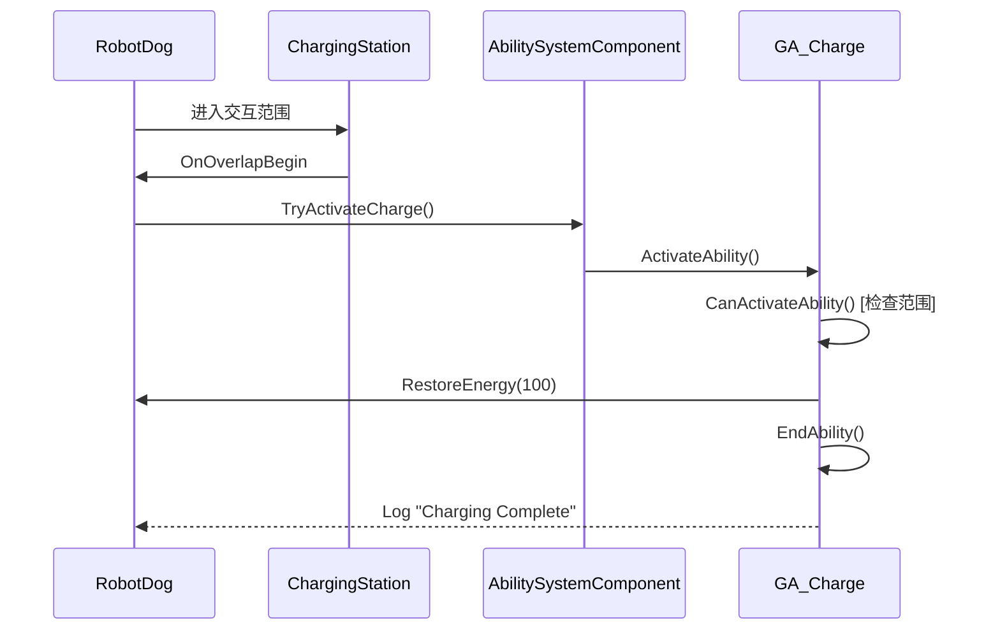
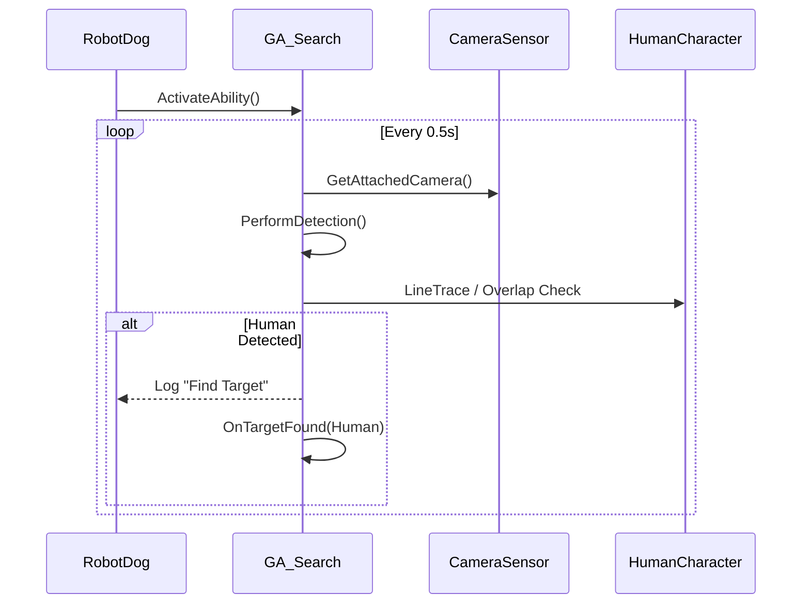
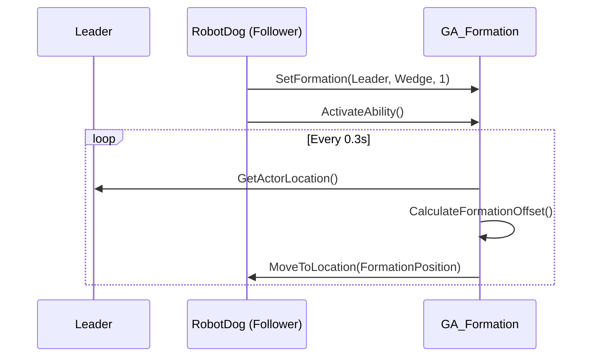

# Design Document: Robot Abilities System

## Overview

本设计文档描述了 MultiAgent-Unreal 项目中机器人能力系统的扩展实现。该系统基于现有的 GAS (Gameplay Ability System) 架构，为 RobotDog 添加电量管理、巡逻、搜索、观察、报告、充电、编队和避障等能力。

## Architecture

### 系统架构图

```
┌─────────────────────────────────────────────────────────────────────────┐
│                         Robot Abilities System                           │
├─────────────────────────────────────────────────────────────────────────┤
│                                                                          │
│  ┌──────────────────┐    ┌──────────────────┐    ┌──────────────────┐  │
│  │  Energy System   │    │ Charging Station │    │   Patrol Path    │  │
│  │  (Attribute)     │◄───│  (Actor)         │    │   (Actor)        │  │
│  └────────┬─────────┘    └──────────────────┘    └──────────────────┘  │
│           │                                                              │
│           ▼                                                              │
│  ┌──────────────────────────────────────────────────────────────────┐  │
│  │                    MAAbilitySystemComponent                       │  │
│  │  ┌──────────┐ ┌──────────┐ ┌──────────┐ ┌──────────┐            │  │
│  │  │GA_Patrol │ │GA_Search │ │GA_Observe│ │GA_Report │            │  │
│  │  └──────────┘ └──────────┘ └──────────┘ └──────────┘            │  │
│  │  ┌──────────┐ ┌──────────┐ ┌──────────┐                         │  │
│  │  │GA_Charge │ │GA_Format │ │GA_Avoid  │                         │  │
│  │  └──────────┘ └──────────┘ └──────────┘                         │  │
│  └──────────────────────────────────────────────────────────────────┘  │
│                                                                          │
│  ┌──────────────────────────────────────────────────────────────────┐  │
│  │                      MARobotDogCharacter                          │  │
│  │  - Energy: float (0-100)                                          │  │
│  │  - EnergyDrainRate: float                                         │  │
│  │  - ShowEnergyDisplay()                                            │  │
│  └──────────────────────────────────────────────────────────────────┘  │
└─────────────────────────────────────────────────────────────────────────┘
```

### 类继承关系

```
UMAGameplayAbilityBase (现有)
    ├── UGA_Patrol (新增)
    ├── UGA_Search (新增)
    ├── UGA_Observe (新增)
    ├── UGA_Report (新增)
    ├── UGA_Charge (新增)
    ├── UGA_Formation (新增)
    └── UGA_Avoid (新增)

AActor (UE)
    ├── AMAChargingStation (新增)
    └── AMAPatrolPath (新增)

AMARobotDogCharacter (现有，扩展)
    └── 添加 Energy 属性和相关方法
```

## Components and Interfaces

### 1. Energy System (MARobotDogCharacter 扩展)

```cpp
// MARobotDogCharacter.h 扩展
class AMARobotDogCharacter : public AMACharacter
{
    // Energy 属性
    UPROPERTY(EditAnywhere, BlueprintReadWrite, Category = "Energy")
    float Energy = 100.f;
    
    UPROPERTY(EditAnywhere, BlueprintReadWrite, Category = "Energy")
    float MaxEnergy = 100.f;
    
    UPROPERTY(EditAnywhere, BlueprintReadWrite, Category = "Energy")
    float EnergyDrainRate = 1.f;  // 每秒消耗
    
    // 电量操作
    UFUNCTION(BlueprintCallable)
    void DrainEnergy(float DeltaTime);
    
    UFUNCTION(BlueprintCallable)
    void RestoreEnergy(float Amount);
    
    UFUNCTION(BlueprintCallable)
    bool HasEnergy() const { return Energy > 0.f; }
    
    // 头顶显示
    void UpdateEnergyDisplay();
};
```

### 2. AMAChargingStation

```cpp
// MAChargingStation.h
UCLASS()
class AMAChargingStation : public AActor
{
    GENERATED_BODY()
    
public:
    AMAChargingStation();
    
    // 交互范围
    UPROPERTY(EditAnywhere, Category = "Charging")
    float InteractionRadius = 300.f;
    
    // 检查机器人是否在范围内
    UFUNCTION(BlueprintCallable)
    bool IsRobotInRange(AMACharacter* Robot) const;
    
protected:
    UPROPERTY(VisibleAnywhere)
    UStaticMeshComponent* MeshComponent;
    
    UPROPERTY(VisibleAnywhere)
    USphereComponent* InteractionSphere;
    
    // Overlap 事件
    UFUNCTION()
    void OnOverlapBegin(UPrimitiveComponent* OverlappedComp, AActor* OtherActor, ...);
    
    UFUNCTION()
    void OnOverlapEnd(UPrimitiveComponent* OverlappedComp, AActor* OtherActor, ...);
};
```

### 3. AMAPatrolPath

```cpp
// MAPatrolPath.h
UCLASS()
class AMAPatrolPath : public AActor
{
    GENERATED_BODY()
    
public:
    // 路径点数组
    UPROPERTY(EditAnywhere, BlueprintReadWrite, Category = "Patrol")
    TArray<FVector> Waypoints;
    
    // 获取下一个路径点
    UFUNCTION(BlueprintCallable)
    FVector GetWaypoint(int32 Index) const;
    
    UFUNCTION(BlueprintCallable)
    int32 GetNextWaypointIndex(int32 CurrentIndex) const;
    
    UFUNCTION(BlueprintCallable)
    int32 GetWaypointCount() const { return Waypoints.Num(); }
    
protected:
    // 编辑器可视化
    virtual void OnConstruction(const FTransform& Transform) override;
};
```

### 4. GA_Patrol

```cpp
// GA_Patrol.h
UCLASS()
class UGA_Patrol : public UMAGameplayAbilityBase
{
    GENERATED_BODY()
    
public:
    // 设置巡逻路径
    UFUNCTION(BlueprintCallable)
    void SetPatrolPath(AMAPatrolPath* InPath);
    
    // 直接设置路径点
    UFUNCTION(BlueprintCallable)
    void SetWaypoints(const TArray<FVector>& InWaypoints);
    
protected:
    virtual void ActivateAbility(...) override;
    virtual void EndAbility(...) override;
    
private:
    TArray<FVector> Waypoints;
    int32 CurrentWaypointIndex = 0;
    FTimerHandle PatrolTimerHandle;
    
    void MoveToNextWaypoint();
    void OnReachedWaypoint();
};
```

### 5. GA_Search

```cpp
// GA_Search.h
UCLASS()
class UGA_Search : public UMAGameplayAbilityBase
{
    GENERATED_BODY()
    
public:
    // 检测间隔
    UPROPERTY(EditDefaultsOnly, Category = "Search")
    float DetectionInterval = 0.5f;
    
    // 检测范围 (使用 Camera FOV)
    UPROPERTY(EditDefaultsOnly, Category = "Search")
    float DetectionRange = 1000.f;
    
protected:
    virtual void ActivateAbility(...) override;
    virtual void EndAbility(...) override;
    
private:
    FTimerHandle SearchTimerHandle;
    
    void PerformDetection();
    bool DetectHumanInView(AMACameraSensor* Camera);
    void OnTargetFound(AMAHumanCharacter* Human);
};
```

### 6. GA_Observe

```cpp
// GA_Observe.h
UCLASS()
class UGA_Observe : public UMAGameplayAbilityBase
{
    GENERATED_BODY()
    
public:
    // 设置观察目标
    UFUNCTION(BlueprintCallable)
    void SetObserveTarget(AActor* InTarget);
    
    // 观察范围
    UPROPERTY(EditDefaultsOnly, Category = "Observe")
    float ObserveRange = 1500.f;
    
protected:
    virtual void ActivateAbility(...) override;
    virtual void EndAbility(...) override;
    
private:
    TWeakObjectPtr<AActor> ObserveTarget;
    FTimerHandle ObserveTimerHandle;
    
    void UpdateObservation();
    void OnTargetLost();
};
```

### 7. GA_Report

```cpp
// GA_Report.h
UCLASS()
class UGA_Report : public UMAGameplayAbilityBase
{
    GENERATED_BODY()
    
public:
    // 设置报告内容
    UFUNCTION(BlueprintCallable)
    void SetReportMessage(const FString& InMessage);
    
    // 显示时长
    UPROPERTY(EditDefaultsOnly, Category = "Report")
    float DisplayDuration = 5.f;
    
protected:
    virtual void ActivateAbility(...) override;
    virtual void EndAbility(...) override;
    
private:
    FString ReportMessage;
    FTimerHandle DisplayTimerHandle;
    
    void ShowReportDialog();
    void HideReportDialog();
};
```

### 8. GA_Charge

```cpp
// GA_Charge.h
UCLASS()
class UGA_Charge : public UMAGameplayAbilityBase
{
    GENERATED_BODY()
    
public:
    UGA_Charge();
    
protected:
    virtual bool CanActivateAbility(...) const override;
    virtual void ActivateAbility(...) override;
    virtual void EndAbility(...) override;
    
private:
    // 检查是否在充电站范围内
    AMAChargingStation* FindNearbyChargingStation() const;
};
```

### 9. GA_Formation

```cpp
// GA_Formation.h

// 编队类型
UENUM(BlueprintType)
enum class EFormationType : uint8
{
    Line,       // 一字排开
    Column,     // 纵队
    Wedge,      // 楔形
    Diamond     // 菱形
};

UCLASS()
class UGA_Formation : public UMAGameplayAbilityBase
{
    GENERATED_BODY()
    
public:
    // 设置编队参数
    UFUNCTION(BlueprintCallable)
    void SetFormation(AMACharacter* InLeader, EFormationType InType, int32 InPosition);
    
    // 编队间距
    UPROPERTY(EditDefaultsOnly, Category = "Formation")
    float FormationSpacing = 200.f;
    
protected:
    virtual void ActivateAbility(...) override;
    virtual void EndAbility(...) override;
    
private:
    TWeakObjectPtr<AMACharacter> Leader;
    EFormationType FormationType;
    int32 FormationPosition;  // 在编队中的位置索引
    FTimerHandle FormationTimerHandle;
    
    void UpdateFormationPosition();
    FVector CalculateFormationOffset() const;
};
```

### 10. GA_Avoid

```cpp
// GA_Avoid.h
UCLASS()
class UGA_Avoid : public UMAGameplayAbilityBase
{
    GENERATED_BODY()
    
public:
    // 检测半径
    UPROPERTY(EditDefaultsOnly, Category = "Avoid")
    float DetectionRadius = 200.f;
    
    // 避障力度
    UPROPERTY(EditDefaultsOnly, Category = "Avoid")
    float AvoidanceStrength = 1.f;
    
protected:
    virtual void ActivateAbility(...) override;
    virtual void EndAbility(...) override;
    
private:
    FTimerHandle AvoidTimerHandle;
    FVector OriginalDestination;
    
    void CheckObstacles();
    FVector CalculateAvoidanceVector(const TArray<AActor*>& Obstacles);
    void ApplyAvoidance(FVector AvoidanceDir);
};
```

## Data Models

### Gameplay Tags 扩展

```cpp
// MAGameplayTags.h 扩展
struct FMAGameplayTags
{
    // 新增 Ability Tags
    FGameplayTag Ability_Patrol;
    FGameplayTag Ability_Search;
    FGameplayTag Ability_Observe;
    FGameplayTag Ability_Report;
    FGameplayTag Ability_Charge;
    FGameplayTag Ability_Formation;
    FGameplayTag Ability_Avoid;
    
    // 新增 Status Tags
    FGameplayTag Status_Patrolling;
    FGameplayTag Status_Searching;
    FGameplayTag Status_Observing;
    FGameplayTag Status_Charging;
    FGameplayTag Status_InFormation;
    FGameplayTag Status_Avoiding;
    FGameplayTag Status_LowEnergy;
    
    // 新增 Event Tags
    FGameplayTag Event_Target_Found;
    FGameplayTag Event_Target_Lost;
    FGameplayTag Event_Charge_Complete;
    FGameplayTag Event_Patrol_WaypointReached;
};
```

### 文件结构

```
unreal_project/Source/MultiAgent/
├── Actor/
│   ├── MAChargingStation.h/cpp      # 新增：充电站
│   └── MAPatrolPath.h/cpp           # 新增：巡逻路径
├── Character/
│   └── MARobotDogCharacter.h/cpp    # 扩展：添加 Energy 系统
├── GAS/
│   ├── MAGameplayTags.h/cpp         # 扩展：新增 Tags
│   ├── MAAbilitySystemComponent.h/cpp  # 扩展：新增 Ability 激活方法
│   └── Ability/
│       ├── GA_Patrol.h/cpp          # 新增
│       ├── GA_Search.h/cpp          # 新增
│       ├── GA_Observe.h/cpp         # 新增
│       ├── GA_Report.h/cpp          # 新增
│       ├── GA_Charge.h/cpp          # 新增
│       ├── GA_Formation.h/cpp       # 新增
│       └── GA_Avoid.h/cpp           # 新增
```

## Error Handling

### Energy System

- 当 Energy <= 0 时，所有移动相关 Ability 的 `CanActivateAbility` 返回 false
- 低电量警告：当 Energy < 20% 时，添加 `Status_LowEnergy` Tag

### GA_Charge

- 如果不在充电站范围内，`CanActivateAbility` 返回 false
- 充电完成后自动结束 Ability

### GA_Search

- 如果没有附着的 CameraSensor，`CanActivateAbility` 返回 false
- 检测失败时记录日志但不中断 Ability

### GA_Formation

- 如果 Leader 无效或被销毁，自动取消 Ability
- 如果无法到达编队位置，尝试最近可达点

### GA_Avoid

- 避障计算失败时保持原路径
- 避障与导航冲突时，避障优先

## Testing Strategy

### 单元测试

1. Energy System
   - 测试电量消耗计算
   - 测试电量恢复
   - 测试低电量状态触发

2. GA_Patrol
   - 测试路径点循环
   - 测试取消巡逻

3. GA_Search
   - 测试 Human 检测逻辑
   - 测试检测范围边界

### 集成测试

1. 充电流程
   - RobotDog 移动到充电站 → 触发 GA_Charge → 电量恢复到 100%

2. 巡逻 + 搜索
   - RobotDog 执行 GA_Patrol → 同时执行 GA_Search → 发现 Human 时输出日志

3. 编队移动
   - 多个 RobotDog 跟随 Leader → 保持编队形状

## Sequence Diagrams

### 充电流程



### 搜索检测流程



### 编队移动流程


