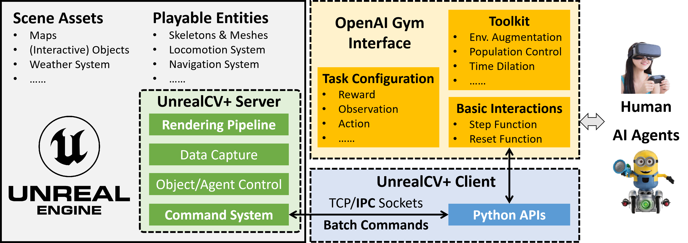
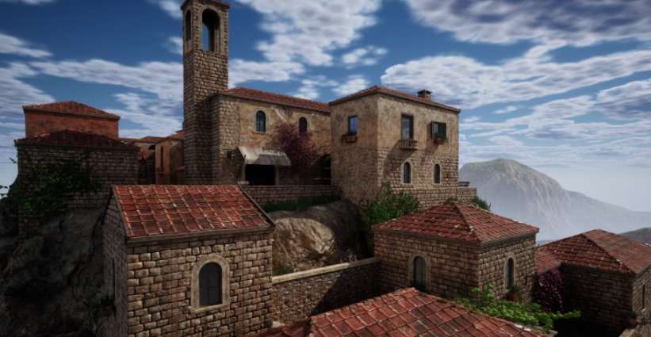
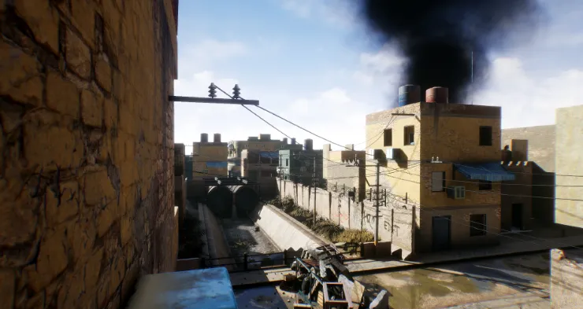
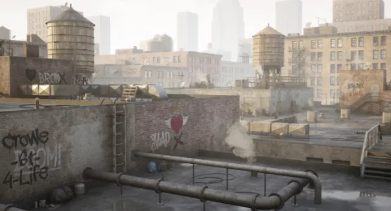

UnrealZoo: Enriching Photo-realistic Virtual Worlds for Embodied AI
===
### ICCV 2025 (Highlights🚀)

[📄 Paper](https://arxiv.org/abs/2412.20977) \| [🌐 Project Page](http://unrealzoo.site/) \| [📝 Document](https://unrealzoo.notion.site/) \| [🤖 ModelScope](https://www.modelscope.cn/organization/UnrealZoo) \| 
[🎬 YouTube](https://www.youtube.com/watch?v=Xe2VmsJYTAU)


# 🔥 News
- 2025/09 We update package to **v1.0.4**, which supports optical flow rendering and fixes some camera-related bugs.  
- 2025/07 We released the full version of UnrealZoo environment package, built on UE5.5 which contains **100+ scenes**.
  - **UnrealZoo_UE5_5_V1.0.1** is available for download, which contains 100+ scenes and playable entities, with a total size of **67GB**.
  - We integrate the latest chaos system for vehicles, enabling more realistic animation(enter/exit) and visual effect(collision, explode, fire, etc.).
  - The **object interaction(pick/drop)** now is available, you could spawn the object anywhere in the map and interact with it, just use one command to change its appearance.
- 2025/03 New Download Link in 🤖[ModelScope](https://www.modelscope.cn/organization/UnrealZoo) is released for fast downloading the UE5 binary.
- 2024/12 Paper Link: [UnrealZoo: Enriching Photo-realistic Virtual Worlds for Embodied AI](https://arxiv.org/abs/2412.20977)
- 2024/12 Comprehensive documentation and Scene Gallery are available in [Notion Page](https://unrealzoo.notion.site/scene-gallery) 
- 2024/12 Project website is available at [UnrealZoo](http://unrealzoo.site/)


# Table of Contents

1. [What is UnrealZoo?](#what-is-unrealzoo)
   - [Key Features](#key-features)
   - [Framework](#framework)
2. [Quick Installation](#quick-installation)
   - [Dependencies](#dependencies)
   - [Install UnrealZoo-Gym](#install-gym-unrealzoo)
   - [Prepare UE Binary](#prepare-ue-binary)
3. [Run the Example Code](#run-the-example-code)
4. [Build your agent](#build-your-agent)
5. [Documentation](#documentation)
6. [TODO List](#todo-list)
7. [License and Acknowledgments](#license-and-acknowledgments)
8. [Citation](#citation)


## What is UnrealZoo?

UnrealZoo is a rich collection of photo-realistic 3D virtual worlds built on Unreal Engine, designed to reflect the complexity and variability of the open worlds. 
There are various playable entities for embodied AI, including human characters, robots, vehicles, and animals.
Integrated with [UnrealCV](https://unrealcv.org/), UnrealZoo provides a suite of easy-to-use Python APIs and tools for various potential applications, such as data annotation and collection, environment augmentation, distributed training, and benchmarking agents.

**💡This repository provides the gym interface based on UnrealCV APIs for UE-based environments, which is compatible with OpenAI Gym and supports the high-level agent-environment interactions in UnrealZoo.**

### Key Features
- **Photorealistic**: High-quality graphics rendering empowered by Unreal Engine 5.5.
- **Large-scale**: 100+ Scenes, the largest one covers 16km².
- **Diverse Scenes**: landscape🏜️🏞️🏝️, historic architecture⛩️🛕🏰, settlement🏘️🏙️, industrial zone🏭🏗️, facilities🤽🏻‍♂️🚉🏪...
- **Diverse Bodies**: human🚶🏻‍♂️️🚶🏻, robot🤖, vehicles🚗🏍️🛩️,animals🐘🐕🐎🐧🐢🐖🐏🐂...
- **Diverse Actions**: running🏃🏻‍♂️, climbing🧗🏻, sitting🧘🏻, jumping, squatting, pick-up...
- **Easy-to-use**: Pre-build UE binaries, integrated with optimized UnrealCV, are to be used without any prior knowledge of UE.
- **Cross-platform**: Runs on Linux, Windows, macOS
- **Flexible Python APIs**: Provide UnrealCV Python APIs and Gym Interfaces for various potential applications.
- **Multi-agent Interactions**: Real-time interaction of 10+ vision-based agents👩‍👩‍👧‍👧 in one scene.

### Framework


[//]: # (- ```UnrealCV``` is the basic bridge between ```Unreal Engine``` and ```OpenAI Gym```.)

[//]: # (- ```OpenAI Gym``` is a toolkit for developing an RL algorithm, compatible with most numerical computation libraries, such as TensorFlow or PyTorch. )
- The ```Unreal Engine Environments (Binary)``` contains the scenes and playable entities.
- The ```UnrealCV+ Server``` is built in the UE binary as a plugin, including modules for rendering , data capture, object/agent control, and command parsing. We have optimized the rendering pipeline and command system in the server.
- The ```UnrealCV+ Client``` provides Python-based utility functions for launching the binary, connecting with the server, and interacting with UE environments. It uses IPC sockets and batch commands for optimized performance.
- The ```OpenAI Gym Interface``` provides agent-level interface for agent-environment interactions, which has been widely used in the community. Our gym interface supports customizing the task in a configuration file and contains a toolkit with a set of gym wrappers for environment augmentation, population control, etc.

## Quick Installation
### Dependencies
- UnrealCV
- Gym
- CV2
- Matplotlib
- Numpy
- Docker(Optional)
- Nvidia-Docker(Optional)
 
We recommend you use [anaconda](https://www.continuum.io/downloads) to install and manage your Python environment.
```CV2``` is used for image processing, like extracting object masks and bounding boxes. ```Matplotlib``` is used for visualization.
### Install UnrealZoo-Gym

It is easy to install unrealzoo-gym, just run
```
git clone https://github.com/UnrealZoo/unrealzoo-gym.git
cd unrealzoo-gym
pip install -e . 
```
While installing gym-unrealcv, dependencies including OpenAI Gym, UnrealCV, numpy and matplotlib are installed.

### Prepare UE Binary
Before running the environments, you need to prepare unreal binaries. The full version of UnrealZoo environment package is built on **UE5.5** and contains **100+ scenes**.

**UE5 Example Scenes**
<table>
  <tr>
    <td>
      <figure>
          
        <figcaption style="text-align: center;"> ChemicalFactory</figcaption>
      </figure>
    </td>
    <td>
      <figure>
          
        <figcaption style="text-align: center;">Modular Old Town</figcaption>
      </figure>
    </td>

  </tr>
  <tr>
    <td>
      <figure>
          
        <figcaption style="text-align: center;">MiddleEast</figcaption>
      </figure>
    </td>
    <td>
      <figure>
          
        <figcaption style="text-align: center;">Roof-City</figcaption>
      </figure>
    </td>
 
  </tr>
</table> 

**Full version Environment Package (UnrealZoo_UE5_5)**
We released the full version of UnrealZoo environment package, built on UE5.5 which contains **100+ scenes**. All maps in the **[scene gallery](https://www.notion.so/Scene-Gallery-a801475ff98943159da66f641f4c38b2)** are included.

🗂️**Download Links:**

| Environment                       | Download Link                                                              | Size       |
|-----------------------------------|----------------------------------------------------------------------------|------------|
| UE5_ExampleScene                  | [🤖ModelScope](https://modelscope.cn/datasets/UnrealZoo/UnrealZoo-UE5/files) | ~10GB      |
|**UnrealZoo_UE5_5_Mac_V1.0.3** | [Cloud](https://pan.baidu.com/s/1lUqQYEkn7mfXd8G8F2tQGA?pwd=xvxh)|    ~67GB |
| **UnrealZoo_UE5_5_Win64_V1.0.4**  | [Cloud](https://pan.baidu.com/s/11myDa5iY1xi0OLziOZi-Nw?pwd=ae7w)         |    ~67GB |
| **UnrealZoo_UE5_5_Linux_V1.0.5**  | [🤖ModelScope](https://modelscope.cn/datasets/UnrealZoo/UnrealZoo-UE5/files) |    ~72GB |


Then unzip and move the downloaded binary to the `UnrealEnv` folder, which is our default location for binaries, the folder structures are as follows:
```
unrealzoo-gym/  
|-- docs/                  
|-- example/                
|-- gym_unrealcv/              
|   |-- envs/    
|   |   |-- agent/     
|   |-- setting/
|   |   |-- env_config/                   # environment config json file location  
...
|-- generate_env_config.py                    # generate environment config json file
...

UnrealEnv/                    # Binary default location
|-- UnrealZoo_UE5_5_Linux_v1.0.5/   # Binary folder
...

```
If there is a permission issue, run the command ```chmod +x ./``` under the ```UnrealEnv``` folder path to give the necessary permissions.
#### Available Map Names in UE5.5 Binary

| Map Name                | Description             |
|-------------------------|-------------------------|
| Map\_ChemicalPlant\_1   | Chemical Factory        |
| Old\_Town               | Modular Old Town        |
| MiddleEast              | Middle East Scene       |
| Demo\_Roof              | Roof-City Scene         |
| DowntownWest            | Downtown West (City)    |
| ModularCity             | Modular City            |

⚠️ **Note**: The full version contains **100+ scenes**, but only the above maps have configuration files ready. Use `generate_env_config.py` to create configs for other maps.

#### Naming rule
We have predefined a naming rule to launch different environment maps and their corresponding task interfaces.  
```Unreal{task}-{MapName}-{ActionSpace}{ObservationType}-v{version} ```
- ```{task}```: the name of the task, we currently support: ```Track```,```Navigation```,```Rendezvous```.
- ```{MapName}```: the name of the map you want to run, ```track_train```, ```Greek_Island```, etc.
- ```{ActionSpace}```: the action space of the agent, ```Discrete```, ```Continuous```, ```Mixed```. (Only Mixed type support interactive actions)
- ```{ObservationType}```: the observation type of the agent, ```Color```, ```Depth```, ```Rgbd```, ```Gray```, ```CG```, ```Mask```, ```Pose```,```MaskDepth```,```ColorMask```.
- ```{version}```: works on ```track_train``` map, ```0-5``` various the augmentation factor(light, obstacles, layout, textures).

## Run the Example Code
#### Hint 💡 
- If your mouse cursor disappears after the game launches, press ``` ` ``` (the key above Tab) to release the mouse cursor from the game.

#### 1. Specify the environment location： 
 ##### Option 1: In the terminal. 
 - Default path to UnrealEnv is in user home directory under .unrealcv  
   - Windows: C:\\Users\\{username}\\.unrealcv\\UnrealEnv
   - Linux: /home/{username}/.unrealcv/UnrealEnv
   - Mac: /Users/{username}/.unrealcv/UnrealEnv
```
export UnrealEnv=/your/path/to/UnrealEnv
```
##### Option 2: In the example code:
Add environment variable in the example code
```
import os
os.environ['UnrealEnv']="/your/path/to/UnrealEnv"
```
#### 2. Run random agents
User could choose a map from the available map list, and run the random agent to interact with the environment.
```
python ./example/random_agent_multi.py -e UnrealTrack-DowntownWest-ContinuousColor-v0
```

#### 3. Run a rule-based tracking agent 

**Available Maps for UE5.5 (UnrealZoo_UE5_5_Linux_v1.0.5):**

⚠️ **Note**: The UE5.5 full version package contains **100+ scenes**, but currently only the following maps have configuration files ready to use. More configuration files will be added in future updates. You can use `generate_env_config.py` to create configuration files for other maps.

**Urban/City Scenes:**
```bash
# Downtown West (市中心西区 - 城市场景，支持人物、汽车、摩托车、无人机)
python ./example/tracking_demo.py -e UnrealTrack-DowntownWest-ContinuousColor-v0

# Modular City (模块化城市 - 城市场景，支持人物、汽车、无人机)
python ./example/tracking_demo.py -e UnrealTrack-ModularCity-ContinuousColor-v0
```

**Other Scenes:**
```bash
# Old Town (老城区)
python ./example/tracking_demo.py -e UnrealTrack-Old_Town-ContinuousColor-v0

# Chemical Plant (化工厂)
python ./example/tracking_demo.py -e UnrealTrack-Map_ChemicalPlant_1-ContinuousColor-v0

# Middle East (中东场景)
python ./example/tracking_demo.py -e UnrealTrack-MiddleEast-ContinuousColor-v0

# Demo Roof (屋顶场景)
python ./example/tracking_demo.py -e UnrealTrack-Demo_Roof-ContinuousColor-v0
```

**Try with Random Agent:**
```bash
# Test any map with random agent
python ./example/random_agent_multi.py -e UnrealTrack-DowntownWest-ContinuousColor-v0
python ./example/random_agent_multi.py -e UnrealTrack-ModularCity-ContinuousColor-v0
```

**Try with Keyboard Control:**
```bash
# Control the agent with keyboard (I, J, K, L keys)
python ./example/keyboard_agent.py -e UnrealTrack-DowntownWest-MixedColor-v0
python ./example/keyboard_agent.py -e UnrealTrack-ModularCity-MixedColor-v0
```

**Quick Test All Maps:**
```bash
# Run the test script to see all available configurations
./test_city_maps.sh
```

#### 4. Run a keyboard tracking agent 
Use the "I", "J", "K", and "L" keys to control the agent's movement.
```
python ./example/keyboard_agent.py -e UnrealTrack-Old_Town-MixedColor-v0
```
#### 5. Run a keyboard Navigation agent
Use the "I", "J", "K", and "L" keys to control the agent's movement.  
Space( ␣ ): Jump.  
Up Arrow(⬆️): Look up.  
Down Arrow(⬇️): Look down.  
(Double "Jump" will trigger the agent to climb)
```
python ./example/Keyboard_NavigationAgent.py -e UnrealNavigation-Demo_Roof-MixedColor-v0
```
Control the agent to navigate to the target location by using the keyboard. 

<table style="width: 100%; text-align: center;">
  <tr>
    <td>
      <figure>
        
           <figcaption> Map Reference(Demo_Roof)</figcaption>
      </figure>
    </td>
    <td>
      <figure>
        
           <figcaption>Target Reference(Demo_Roof)</figcaption>
      </figure>
    </td>
  </tr>

  </table> 

## Build your agent
You can build your agent based on the latest method in reinforcement learning, evaluating it in UnrealZoo.
- Reinforcement Learning
  - Online RL
    - [Visual Navigation Agent]() comming soon..

  - Offline RL
    - [Embodied Visual Tracking Agent(ECCV24)](https://github.com/wukui-muc/Offline_RL_Active_Tracking)
- Large Vision-Language Model
  


## Documentation
- **[Setup Summary](SUMMARY.md)** - Quick overview of available maps and setup
- **[City Maps Guide](CITY_MAPS_GUIDE.md)** - Detailed guide for city/urban maps
- **[Configuration File Guide](doc/ConfigFileGuide.md)** - Learn how to create configuration files for new maps
- **[Wrapper Documentation](doc/wrapper.md)** - FPS control, population randomization, and other wrappers
- **[Adding New Environments](doc/addEnv.md)** - Guide for adding new environments to unrealzoo-gym

# 🗓️ TODO List
- [x]  Release an all-in-one package of the collected environments
- [ ]  Add gym interface for heterogeneous mutli-agent co-operation.
- [x]  Expand the list of supported interactive actions.
- [x]  Add more detailed examples for reinforcement learning agents.
- [x]  Add more detailed examples for large vision-language models.

## License and Acknowledgments
The UnrealZoo project is licensed under the Apache 2.0. 
We acknowledge the following projects for their contributions to the UnrealZoo project:
- [UnrealCV](https://unrealcv.org/)
- [OpenAI Gym](https://gym.openai.com/)
- [Unreal Engine](https://www.unrealengine.com/)
- [The fantastic Plugins/Content from UE Marketplace](https://www.unrealengine.com/marketplace)
  -  [Smart Locomotion](https://www.fab.com/zh-cn/listings/7f881534-bf40-493b-97b4-a917daa87af0)
  -  [Animal Pack](https://www.fab.com/zh-cn/listings/856c42d7-58a3-4b95-8f70-1302e5bdafa0)
  -  [Drivable Car](https://www.fab.com/zh-cn/listings/65a0844c-6be4-4e38-9d7a-b9697681a274)
  - ...

## Citation

If you use UnrealZoo in your research, please consider citing:

```bibtex
@misc{zhong2024unrealzoo,
      title={UnrealZoo: Enriching Photo-realistic Virtual Worlds for Embodied AI}, 
      author={Fangwei Zhong and Kui Wu and Churan Wang and Hao Chen and Hai Ci and Zhoujun Li and Yizhou Wang},
      year={2024},
      eprint={2412.20977},
      archivePrefix={arXiv},
      primaryClass={cs.AI},
      url={https://arxiv.org/abs/2412.20977}, 
}
