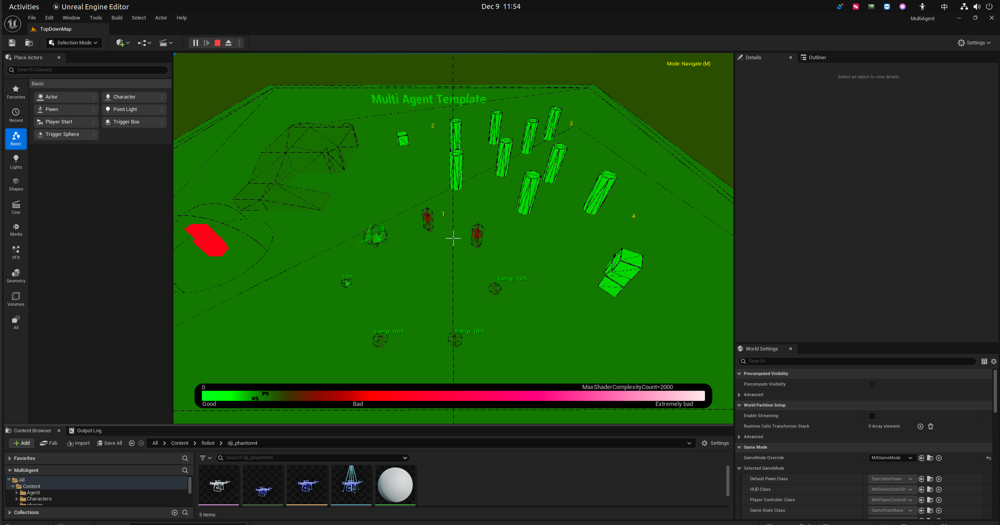

# 调试技巧

## 碰撞体可视化

### 方法 1：控制台命令 `show collision`
运行游戏时按 `~` 打开控制台，输入：
```
show collision
```
会显示所有碰撞体的线框（Capsule、Box、Sphere 等）。

### 方法 2：F5 切换碰撞视图
运行游戏时按 `F5` 切换到 Collision 视图模式，可以直观看到所有碰撞体。

### 方法 3：编辑器视口
在编辑器视口左上角点击 `Show` → `Collision`，或快捷键 `Alt + C`。

## 常用控制台命令

| 命令 | 说明 |
|------|------|
| `show collision` | 显示碰撞体线框 |
| `show bounds` | 显示边界框 |
| `stat fps` | 显示帧率 |
| `stat unit` | 显示各线程耗时 |
| `slomo 0.5` | 慢动作（0.5 倍速） |


