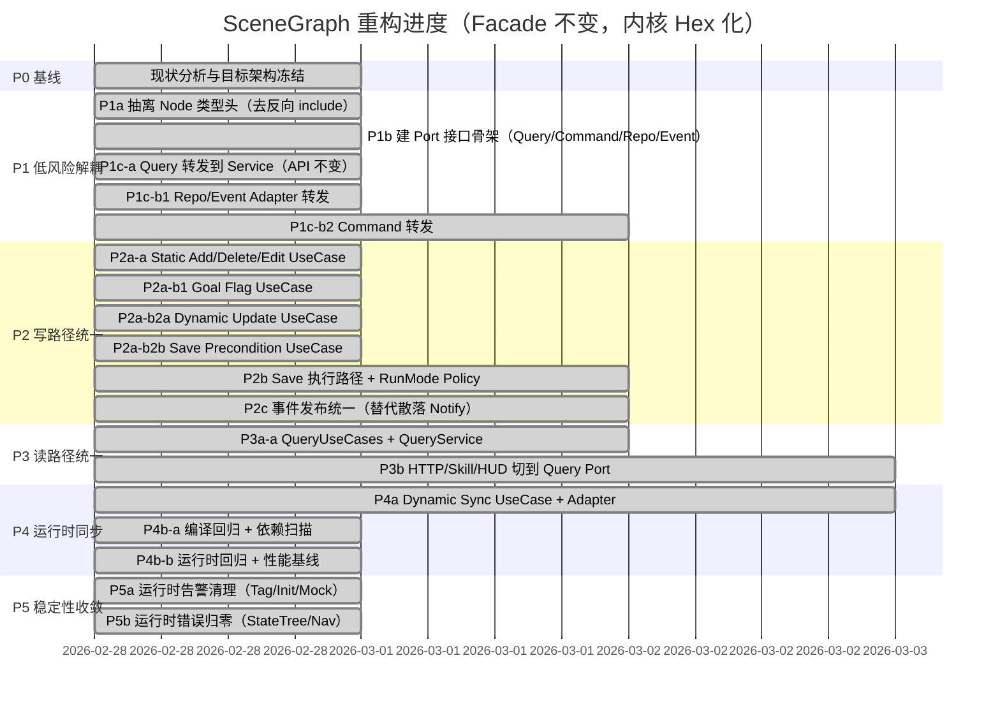

# SceneGraph Refactor Progress

Updated: 2026-02-28

## Current Status

- Completed: `P1a` 拆分 `FMASceneGraphNode` 类型头 (`MASceneGraphNodeTypes.h`)
- Completed: `P1b` 建立 Port 接口骨架 (`scene_graph_ports/*`)
- Completed: `P1c-a` 查询路径转发到 `FMASceneGraphQueryService`（`UMASceneGraphManager` API 保持不变）
- Completed: `P1c-b1` `Repository/Event` 端口适配完成（I/O 与消息发送已通过 adapter）
- Completed: `P1c-b2` `Command` 写路径已切到 `CommandPort -> CommandService -> Internal`
- Completed: `P2a-a` 静态图增删改用例抽离 (`MASceneGraphCommandUseCases`)
- Completed: `P2a-b1` Goal 标记逻辑抽离到 `CommandUseCases`
- Completed: `P2a-b2a` 动态更新逻辑抽离到 `CommandUseCases`
- Completed: `P2a-b2b` Save 前置校验抽离到 `CommandUseCases`
- Completed: `P2b` Save 执行路径与 RunMode Policy 已收敛到 `CommandUseCases::SaveWorkingCopy`
- Completed: `P2c` 事件发布统一（`NotifySceneChange` 全部改为强类型事件并通过 adapter 发布）
- Completed: `P3a-a` Query UseCases 落地并接入 `QueryService`
- Completed: `P3b` HTTP/Skill 读路径已切到统一 QueryUseCases/QueryPort 链路
- Completed: `P4a` Dynamic Sync UseCase + Adapter（Updater 主路径已接入）
- Completed: `P4b-a` 编译级回归与依赖清理检查
- Completed: `P4b-b` 运行时回归/性能基线校验（headless smoke 已完成并记录）
- Completed: `P5a` 运行时告警清理（GameplayTag/初始化测试/Mock数据路径）
- Completed: `P5b` 运行时错误归零（StateTree 启动时机 + Nav 假成功日志级别）

## Gantt

## Notes

- 兼容目标: `UMASceneGraphManager` 对外 API 保持不变，避免影响现有 UI/Agent/Core 调用。
- 本阶段已验证编译通过 (`MultiAgentEditor Mac Development`)。
- `P1c-a` 结果：`MASceneGraphManager` 不再直接依赖 `FMASceneGraphQuery::*`，统一通过 `QueryPort` -> `FMASceneGraphQueryService` 转发。
- `P1c-b1` 结果：`Load/Save/GetSourcePath` 与 `NotifySceneChange` 已经通过 `RepositoryPort` / `EventPublisherPort` 转发。
- `P1c-b2` 结果：`AddNode/DeleteNode/EditNode/SetGoal/UnsetGoal/SaveToSource/UpdateDynamic*` 已改为 `public API -> CommandPort -> FMASceneGraphCommandService -> *Internal`。
- `P2a-a` 结果：`AddNodeInternal/DeleteNodeInternal/EditStaticNode` 的静态图变更逻辑已迁移到 `FMASceneGraphCommandUseCases`，manager 仅保留编排与校验入口。
- `P2a-b1` 结果：`SetNodeAsGoalInternal/UnsetNodeAsGoalInternal` 的节点查找与 JSON 改写逻辑已迁移到 `FMASceneGraphCommandUseCases::BuildNodeJsonWithGoalFlag`。
- `P2a-b2a` 结果：`UpdateDynamicNodePositionInternal/UpdateDynamicNodeFeatureInternal` 已改为调用 `FMASceneGraphCommandUseCases`。
- `P2a-b2b` 结果：`SaveToSourceInternal` 的保存前置条件判断（RunMode/WorkingCopy/SourcePath）已改为调用 `FMASceneGraphCommandUseCases::CheckSavePreconditions`。
- `P2b` 结果：`SaveToSourceInternal` 的策略+执行链已统一到 `FMASceneGraphCommandUseCases::SaveWorkingCopy`（manager 仅保留日志分流）。
- `P2c` 结果：`NotifySceneChange` / `EventPublisherPort` / `EventPublisherAdapter` 已切换到 `EMASceneChangeType` 强类型链路，移除了字符串映射分散点。
- `P3a-a` 结果：新增 `FMASceneGraphQueryUseCases`，`FMASceneGraphQueryService` 已改为通过 usecase 执行 `Find/Get/WorldState` 路径。
- `P3b` 结果：`Agent/Skill/Utils` 中原本直接依赖 `FMASceneGraphQuery` 的调用已切换到 `FMASceneGraphQueryUseCases`，HTTP 路径保持通过 `UMASceneGraphManager` 查询端口。
- `P4a` 结果：新增 `IMASceneGraphRuntimeSyncPort` + `FMASceneGraphRuntimeSyncAdapter` + `FMASceneGraphRuntimeSyncUseCases`，`MASceneGraphUpdater` 的机器人位置、携带物、目标节点跟随、周期位置/电量同步主路径已接入 usecase；`Place/HandleHazard` 场景也已收敛到 runtime sync usecase（`Agent/Skill/Utils` 无直连 `UpdateDynamicNode*` 调用）。
- `P4b-a` 结果：已完成编译级回归（`MultiAgentEditor Mac Development` 通过）并确认 `Agent/Skill/Utils` 不再直接引用 `FMASceneGraphQuery`。
- `P4b-b` 结果：已完成 headless 运行时 smoke（目录：`tmp/runtime_smoke_20260228_173304`，`summary_metrics.txt`）。指标：`sync_updates=33`、`execute_skill_list=1`、`handled_ensure=4`、`fatal=0`。
- `P5a` 结果：已完成运行时告警清理并复测（目录：`tmp/runtime_smoke_20260228_174016`，`summary_metrics.txt`）。指标：`sync_updates=47`、`execute_skill_list=1`、`handled_ensure=0`、`fatal=0`、`missing_gameplay_tags=0`、`comm_messageid_init_errors=0`、`pip_cameraid_init_errors=0`、`mock_data_missing=0`。
- `P5b` 结果：已完成 StateTree 启动时机收敛与 Nav 假成功日志级别调整（`FALSE SUCCESS` 统一为 `Warning`），并复测（目录：`tmp/runtime_smoke_20260228_174727`，`summary_metrics.txt`）。指标：`sync_updates=49`、`execute_skill_list=1`、`handled_ensure=0`、`fatal=0`、`state_tree_asset_errors=0`、`total_error_lines=0`。
