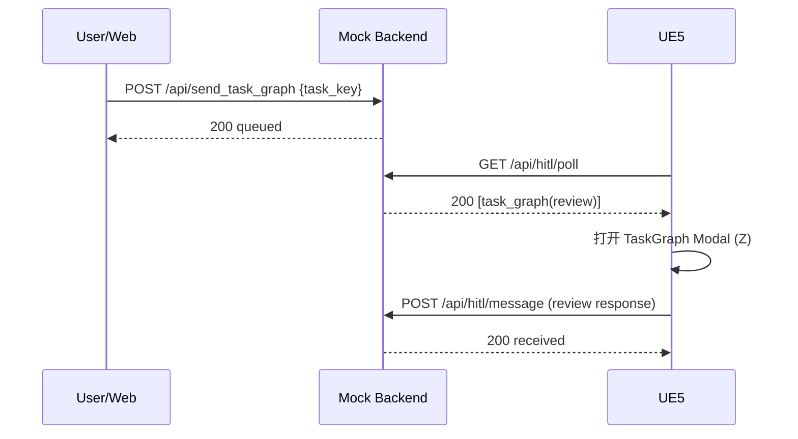

# API 参考

本页基于当前代码实现，描述 `scripts/mock_backend.py` 暴露的 HTTP/SSE 接口，以及 UE 侧实际使用的消息信封格式。

## 1. 基础约定

- Base URL：`http://<host>:<port>`（默认 `http://localhost:8081`）
- 数据格式：`application/json`
- 编码：`UTF-8`
- CORS：已开启（`Access-Control-Allow-Origin: *`）

## 2. 接口总览

## 2.1 控制与观测接口（人/工具调用）

| Method | Path | 用途 |
|---|---|---|
| GET | `/` | Web 控制台页面 |
| GET | `/api/health` | 健康检查 |
| GET | `/api/ue_status` | UE 连接状态 |
| GET | `/api/messages` | SSE 实时消息流 |
| POST | `/api/send_task_graph` | 下发任务图（HITL 审核） |
| POST | `/api/send_skill_allocation` | 下发技能分配（HITL 审核） |
| POST | `/api/send_skill` | 下发技能列表（直接执行） |
| POST | `/api/send_request_user_command` | 请求 UE 端用户输入指令 |

## 2.2 UE 轮询接口（UE -> Backend）

| Method | Path | 用途 |
|---|---|---|
| GET | `/api/sim/poll` | 轮询 Platform 消息（如 `skill_list`） |
| GET | `/api/hitl/poll` | 轮询 HITL 消息（如 `task_graph`、`skill_allocation`） |

## 2.3 UE 回传接口（UE -> Backend）

| Method | Path | 用途 |
|---|---|---|
| POST | `/api/sim/message` | 回传 Platform 类消息 |
| POST | `/api/hitl/message` | 回传 HITL 响应（review/decision/instruction） |
| POST | `/api/sim/scene_change` | 回传场景变化 |

## 3. 消息信封格式（推荐）

推荐外部系统统一使用以下信封（与 UE 侧 `FMAMessageEnvelope` 对齐）：

```json
{
  "message_id": "550e8400-e29b-41d4-a716-446655440000",
  "message_category": "instruction|review|decision|platform",
  "message_type": "task_graph|skill_allocation|skill_list|user_instruction|...",
  "direction": "python_to_ue5|ue5_to_python",
  "timestamp": "2026-03-03T10:30:00.000Z",
  "payload": {}
}
```

说明：
- `message_category` 缺失时，UE 会根据 `message_type` 推断类别（兼容模式）。
- `timestamp` 支持 ISO 8601 字符串；旧格式数字时间戳也能被 UE 解析。

## 4. 控制接口详情

## 4.1 POST `/api/send_task_graph`

将预设任务图入队到 HITL 队列（UE 通过 `/api/hitl/poll` 获取）。

请求：

```json
{
  "task_key": "warehouse_patrol"
}
```

成功响应：

```json
{
  "status": "queued",
  "endpoint": "/api/hitl/poll",
  "task_graph": "warehouse_patrol",
  "message_id": "..."
}
```

失败响应（未知 key）：

```json
{
  "error": "Unknown task graph: xxx"
}
```

## 4.2 POST `/api/send_skill_allocation`

将预设技能分配入队到 HITL 队列。

请求：

```json
{
  "allocation_key": "complete_test"
}
```

成功响应：

```json
{
  "status": "queued",
  "endpoint": "/api/hitl/poll",
  "allocation": "complete_test",
  "message_id": "..."
}
```

## 4.3 POST `/api/send_skill`

将预设技能列表入队到 Platform 队列（UE 侧直接执行）。

请求：

```json
{
  "skill_key": "uav_search"
}
```

成功响应：

```json
{
  "status": "queued",
  "skill": "uav_search",
  "message_id": "..."
}
```

## 4.4 POST `/api/send_request_user_command`

请求 UE 端弹出“等待用户输入指令”流程。

请求体：空

成功响应：

```json
{
  "status": "queued",
  "message_type": "user_instruction",
  "message_id": "..."
}
```

## 4.5 GET `/api/ue_status`

返回 UE 连接状态（基于最近轮询心跳）。

响应：

```json
{
  "connected": true,
  "last_poll_seconds_ago": 0.532,
  "timeout_seconds": 5.0
}
```

## 4.6 GET `/api/messages`（SSE）

- `Content-Type: text/event-stream`
- 用于 Web UI 实时显示通信日志
- 30 秒无消息时会发送 heartbeat

## 5. UE 轮询接口详情

## 5.1 GET `/api/sim/poll`

- 有消息：`200`，返回数组（当前实现每次返回 1 条）
- 无消息：`204 No Content`

`200` 示例：

```json
[
  {
    "message_type": "skill_list",
    "message_category": "platform",
    "timestamp": 1772520000000,
    "message_id": "...",
    "direction": "outbound",
    "payload": {
      "0": {
        "UAV-1": { "skill": "take_off", "params": {} }
      }
    }
  }
]
```

## 5.2 GET `/api/hitl/poll`

- 有消息：`200` + 消息数组
- 无消息：`204 No Content`

`200` 示例（task_graph）：

```json
[
  {
    "message_id": "...",
    "message_category": "review",
    "message_type": "task_graph",
    "direction": "python_to_ue5",
    "timestamp": "2026-03-03T10:30:00.000000",
    "payload": {
      "review_type": "task_graph",
      "data": {
        "meta": {},
        "task_graph": { "nodes": [], "edges": [] }
      }
    }
  }
]
```

## 6. UE 回传接口详情

## 6.1 POST `/api/sim/message`

用途：UE 回传 Platform 类消息（如任务反馈）。

成功响应：

```json
{ "status": "received" }
```

## 6.2 POST `/api/hitl/message`

用途：UE 回传 HITL 结果（审阅确认/拒绝、决策结果等）。

示例（审阅响应）：

```json
{
  "message_id": "...",
  "message_category": "review",
  "message_type": "skill_allocation",
  "direction": "ue5_to_python",
  "timestamp": "2026-03-03T10:35:00.000Z",
  "payload": {
    "approved": true,
    "modified_data": {}
  }
}
```

示例（决策响应）：

```json
{
  "message_id": "...",
  "message_category": "decision",
  "message_type": "custom",
  "direction": "ue5_to_python",
  "timestamp": "2026-03-03T10:36:00.000Z",
  "payload": {
    "decision": "end_task",
    "decision_data": {},
    "user_feedback": "确认终止"
  }
}
```

## 6.3 POST `/api/sim/scene_change`

用途：UE 回传场景变化事件。

请求示例：

```json
{
  "change_type": "node_added",
  "payload": {}
}
```

响应：

```json
{ "status": "received" }
```

## 7. TaskGraph 审核时序（示例）



## 8. 状态码与错误

| 场景 | 状态码 |
|---|---|
| 成功返回数据 | `200` |
| 轮询无新消息 | `204` |
| JSON 解析失败/参数错误 | `400` |
| 路由不存在 | `404` |

## 9. 已知注意事项

- `/api/send_final_skill` 在前端 JS 中有调用入口，但后端当前未实现对应路由。用于对外集成时请忽略该接口。
- 若要稳定集成，建议始终发送完整消息信封（包含 `message_category`、`direction`、`timestamp`）。
