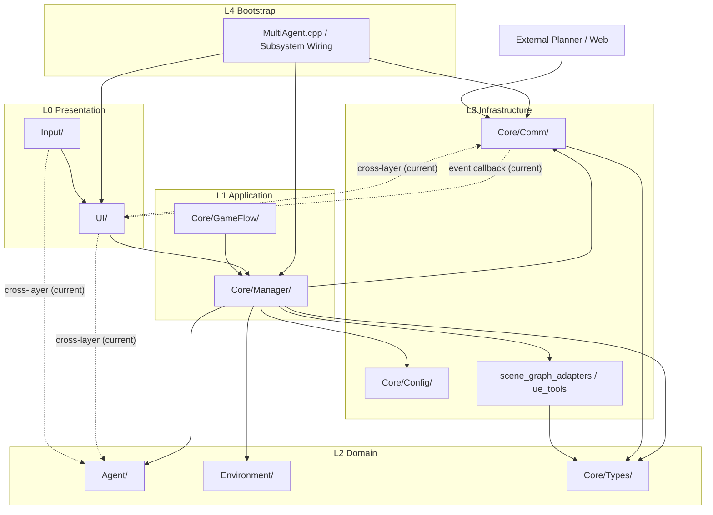

# 架构

本页目标：
- 快速看懂项目目录结构
- 明确“最底层”与“最上层（UI）”
- 用 2D 分层图理解模块关系

## 1. 项目文件夹 Tree（高层）

```text
MultiAgent-Unreal/
├── config/                     # 仿真配置（map_type、navigation、server 等）
├── datasets/                   # 场景图与示例数据
├── scripts/                    # Mock backend 与工具脚本
├── site_docs/                  # 对外文档站点（GitHub Pages 源）
├── unreal_project/
│   ├── Config/                 # UE 项目配置
│   ├── Content/                # 资源资产
│   └── Source/
│       └── MultiAgent/
│           ├── Core/           # 核心系统（通信、管理器、类型、配置）
│           ├── Agent/          # 机器人角色、技能、StateTree
│           ├── Environment/    # 环境实体/特效/场景辅助
│           ├── Input/          # 输入绑定与 PlayerController
│           ├── UI/             # HUD、Modal、TaskGraph、SkillAllocation
│           └── Utils/          # 通用工具
├── mac_compile_and_start.sh
└── README.md
```

## 2. `Source/MultiAgent` 详细 Tree（核心）

```text
unreal_project/Source/MultiAgent/
├── Core/
│   ├── Types/
│   ├── Config/
│   ├── Comm/
│   ├── GameFlow/
│   └── Manager/
│       ├── scene_graph_ports/
│       ├── scene_graph_adapters/
│       ├── scene_graph_services/
│       └── ue_tools/
├── Agent/
│   ├── Character/
│   ├── Component/
│   │   └── Sensor/
│   ├── Skill/
│   │   ├── Impl/
│   │   └── Utils/
│   └── StateTree/
│       ├── Task/
│       └── Condition/
├── Environment/
│   ├── Entity/
│   ├── Effect/
│   └── Utils/
├── Input/
├── UI/
│   ├── Core/
│   ├── HUD/
│   ├── Modal/
│   ├── Mode/
│   ├── TaskGraph/
│   ├── SkillAllocation/
│   │   └── Gantt/
│   ├── Components/
│   ├── Setup/
│   └── Legacy/
└── Utils/
```

## 3. 五层映射（按 L0~L4）

按你给出的 5 层模型，把当前代码先映射为：

| 层级 | 代码映射（当前） | 说明 |
|---|---|---|
| L0 Presentation | `UI/`, `Input/` | 交互入口、HUD、Modal、按键鼠标事件 |
| L1 Application | `Core/Manager/`, `Core/GameFlow/` | 用例编排、调度、Facade/协调逻辑 |
| L2 Domain | `Agent/`, `Environment/`, `Core/Types/` | 机器人/环境核心规则、状态与领域模型 |
| L3 Infrastructure | `Core/Comm/`, `Core/Config/`, `Core/Manager/scene_graph_adapters`, `Core/Manager/ue_tools` | HTTP/轮询、配置/文件、UE 适配器与外部依赖 |
| L4 Bootstrap | `MultiAgent.cpp` + Subsystem 初始化装配点 | 模块启动与依赖组装，不承载业务规则 |

当前判断：
- **最底层（业务意义）**：`L2 Domain`（`Agent/Environment/Core/Types`）
- **最上层（接近 UI）**：`L0 Presentation`（`UI/Input`）

## 4. 2D 分层架构图（含跨层连接现状）



## 5. 现状解读

- 图中的**实线**是目标依赖方向（推荐长期保留）。
- 图中的**虚线**是当前项目里已存在的跨层直连（本页保留展示，不做粉饰）。
- 如果后续你要做“严格五层”，优先消除 `L0 -> L2/L3` 的直连，把入口收敛到 `L1`。
