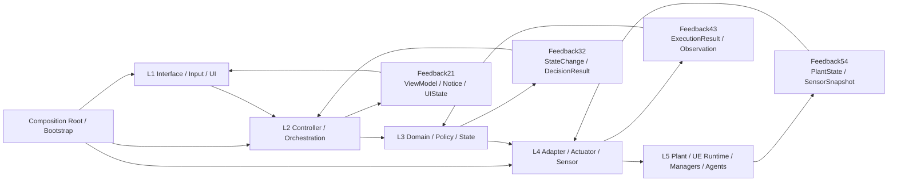
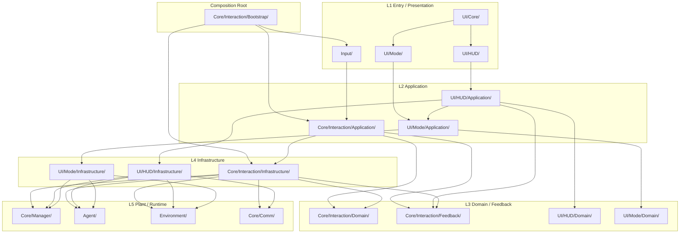

# 架构

本页只保留当前仓库最重要的两张图：
- 自动控制架构图
- folder 依赖图

目标是快速回答两个问题：
- 运行时控制链怎么走
- 代码目录的依赖边界怎么划

## 1. 自动控制架构图（当前基线）

说明：
- 这张图表示**逻辑控制流 / 反馈流**。
- 前向控制严格按 `L1 -> L2 -> L3 -> L4 -> L5`。
- 当动作真正触达运行时系统时，反馈按 `L5 -> FB54 -> L4 -> FB43 -> L3 -> FB32 -> L2 -> FB21 -> L1` 回传。
- 纯 `L2/L3` 编排或 UI 状态变更，可以从最近层级直接产生 `FB21`，不需要伪造 `L5` 观测。
- `Composition Root / Bootstrap` 只负责装配，不承载业务规则。

当前仓库的主映射：
- `L1`: `Input/`、`UI/`
- `L2`: `Core/Interaction/Application/`、`UI/HUD/Application/`、`UI/Mode/Application/`
- `L3`: `Core/Interaction/Domain/`、`Core/Interaction/Feedback/`、`UI/HUD/Domain/`、`UI/Mode/Domain/`
- `L4`: `Core/Interaction/Infrastructure/`、`UI/HUD/Infrastructure/`、`UI/Mode/Infrastructure/`
- `L5`: `Core/Manager/`、`Agent/`、`Environment/`、`Core/Comm/`
- `CR`: `Core/Interaction/Bootstrap/`

## 2. Folder 图（当前实现）

说明：
- 这张图中的箭头表示**编译期依赖方向 / include 方向**，不是运行时控制流。
- 因此 `L4 -> L3` 是允许的，表示 Infrastructure 依赖 Domain/Feedback 的类型定义。
- 真正禁止的是 `L3 -> L4`，也就是 Domain 反向依赖 runtime adapter。

## 3. 必要说明

- 当前仓库已经把 `Input` 主线收敛到 `Core/Interaction/*`，`PlayerController` 主要保留入口职责。
- `UI/HUD/Application` 与 `UI/Mode/Application` 已经去掉直接 `GetWorld/GetSubsystem`，运行时访问统一下沉到各自的 `Infrastructure` adapter。
- `FB21` 已是统一 UI 反馈通道；命令派发链路已走通完整 `FB54 -> FB43 -> FB32 -> FB21`。
- `scripts/check_interaction_architecture.py` 是架构守卫，用来阻止层级回退。
- 如果后续继续重构，新代码默认应复用本页这套 `L1-L5 + Feedback + Bootstrap` 骨架，而不是再新开平行通道。
