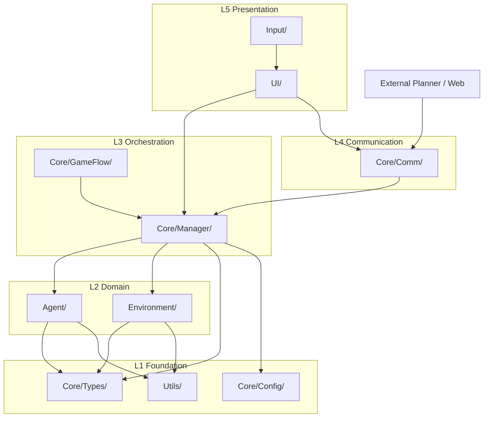

# 架构

本页目标：
- 快速看懂项目目录结构
- 明确“最底层”与“最上层（UI）”
- 用 2D 分层图理解模块关系

## 1. 项目文件夹 Tree（高层）

```text
MultiAgent-Unreal/
├── config/                     # 仿真配置（map_type、navigation、server 等）
├── datasets/                   # 场景图与示例数据
├── scripts/                    # Mock backend 与工具脚本
├── site_docs/                  # 对外文档站点（GitHub Pages 源）
├── unreal_project/
│   ├── Config/                 # UE 项目配置
│   ├── Content/                # 资源资产
│   └── Source/
│       └── MultiAgent/
│           ├── Core/           # 核心系统（通信、管理器、类型、配置）
│           ├── Agent/          # 机器人角色、技能、StateTree
│           ├── Environment/    # 环境实体/特效/场景辅助
│           ├── Input/          # 输入绑定与 PlayerController
│           ├── UI/             # HUD、Modal、TaskGraph、SkillAllocation
│           └── Utils/          # 通用工具
├── mac_compile_and_start.sh
└── README.md
```

## 2. `Source/MultiAgent` 详细 Tree（核心）

```text
unreal_project/Source/MultiAgent/
├── Core/
│   ├── Types/
│   ├── Config/
│   ├── Comm/
│   ├── GameFlow/
│   └── Manager/
│       ├── scene_graph_ports/
│       ├── scene_graph_adapters/
│       ├── scene_graph_services/
│       └── ue_tools/
├── Agent/
│   ├── Character/
│   ├── Component/
│   │   └── Sensor/
│   ├── Skill/
│   │   ├── Impl/
│   │   └── Utils/
│   └── StateTree/
│       ├── Task/
│       └── Condition/
├── Environment/
│   ├── Entity/
│   ├── Effect/
│   └── Utils/
├── Input/
├── UI/
│   ├── Core/
│   ├── HUD/
│   ├── Modal/
│   ├── Mode/
│   ├── TaskGraph/
│   ├── SkillAllocation/
│   │   └── Gantt/
│   ├── Components/
│   ├── Setup/
│   └── Legacy/
└── Utils/
```

## 3. 分层判断（从底到顶）

按当前代码组织和依赖方向，建议这样理解：

| 层级 | 主要文件夹 | 说明 |
|---|---|---|
| L1 基础层（最底层） | `Core/Types`, `Core/Config`, `Utils` | 类型定义、配置模型、通用工具；不面向 UI 展示 |
| L2 领域层 | `Agent`, `Environment` | 机器人与环境行为实体，承载核心仿真语义 |
| L3 编排层 | `Core/Manager`, `Core/GameFlow` | 调度、生命周期、场景图/命令等业务编排 |
| L4 通信层 | `Core/Comm` | UE 与外部后端的消息桥接与协议处理 |
| L5 表现层（最上层） | `UI`, `Input` | 用户交互、面板/模态、按键与鼠标输入 |

结论：
- **最底层**：`Core/Types + Core/Config + Utils`
- **最上层（接近 UI）**：`UI`（`Input` 与其同层，负责入口交互）

## 4. 2D 分层架构图



## 5. 读图建议

- 先看 L5：明确用户入口（按键、面板、模态）
- 再看 L3/L4：任务如何调度、消息如何流动
- 最后看 L2/L1：具体行为实现和基础定义
