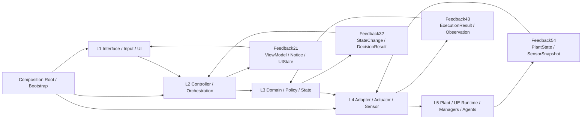

# 架构

本页只保留当前仓库最重要的两张图：
- 自动控制架构图
- folder 依赖图

目标是快速回答两个问题：
- 运行时控制链怎么走
- 代码目录的依赖边界怎么划

## 1. 自动控制架构图（当前基线）

说明：
- 这张图表示**逻辑控制流 / 反馈流**。
- 前向控制严格按 `L1 -> L2 -> L3 -> L4 -> L5`。
- 当动作真正触达运行时系统时，反馈按 `L5 -> FB54 -> L4 -> FB43 -> L3 -> FB32 -> L2 -> FB21 -> L1` 回传。
- 纯 `L2/L3` 编排或 UI 状态变更，可以从最近层级直接产生 `FB21`，不需要伪造 `L5` 观测。
- `Composition Root / Bootstrap` 只负责装配，不承载业务规则。

当前仓库的主映射：

| 层级 | 当前 folder 映射 |
|---|---|
| `L1` | `Input/`、`UI/` |
| `L2` | `Core/Interaction/Application/`、`Core/SceneGraph/Application/`、`UI/HUD/Application/`、`UI/Mode/Application/` |
| `L3` | `Core/Interaction/Domain/`、`Core/Interaction/Feedback/`、`Core/SceneGraph/Domain/`、`Core/Camera/Domain/`、`UI/HUD/Domain/`、`UI/Mode/Domain/` |
| `L4` | `Core/Interaction/Infrastructure/`、`Core/SceneGraph/Infrastructure/`、`Core/Camera/Infrastructure/`、`UI/HUD/Infrastructure/`、`UI/Mode/Infrastructure/` |
| `L5` | `Core/SceneGraph/Runtime/`、`Core/Camera/Runtime/`、`Core/Editing/Runtime/`、`Core/Selection/Runtime/`、`Core/Manager/`、`Agent/`、`Environment/`、`Core/Comm/` |
| `CR` | `Core/Interaction/Bootstrap/` |

补充：
- `Core/Interaction/Feedback/` 现在同时承载 feedback 合同类型和纯 feedback 翻译逻辑，例如 `MAFeedbackPipeline`。
- `Core/Interaction/Infrastructure/` 应只保留真正触达 Unreal runtime / HUD / Manager 的 adapter 与 applier。
- `Core/Interaction/Application/` 不再直接 include `Infrastructure`；运行时访问统一经由 `PlayerController / Bootstrap` 的桥接入口转发。
- `Core/SceneGraph/` 现在是独立上下文，不再继续把 SceneGraph 类型、服务、工具和 UE 同步逻辑塞回 `Core/Manager/`。
- `Core/Camera/` 现在承载 `PIP / ExternalCamera / Viewport` 这一组相机能力；`MAPIPCameraTypes` 也已从 `Core/Types/` 迁入 `Core/Camera/Domain/`。
- `Core/Editing/` 目前已先把 `MAEditModeManager` 抽到 `Runtime/`，用于承接 UI 编辑流程与 SceneGraph 之间的运行时桥接。
- `Core/Selection/` 目前已先把 `MASelectionManager` 抽到 `Runtime/`，用于承接框选、编组和选中态运行时同步。
- `Core/Camera/` 当前主要落在 `Domain / Infrastructure / Runtime`；后续如果出现更明确的相机 workflow，再补 `Application / Feedback / Bootstrap`。

## 2. Folder 图（当前实现）

说明：
- 这张图现在改成**层级归属图**，重点表达 folder 落位，不再试图完整表达所有编译期依赖。
- 为避免和控制流方向混淆，图中**不显式绘制** `L4 -> L3` 这类“Infrastructure 依赖 Domain/Feedback 合同类型”的边。
- 需要记住的规则仍然是：
  - `L3 -> L4` 禁止
  - `L4` 可以消费 `L3` 的状态 / DTO / feedback 类型
  - 这类合同依赖保留在说明里，不放进图里制造反向视觉噪音

```mermaid
flowchart TB
    subgraph CR["Composition Root"]
        BOOT["Core/Interaction/Bootstrap/"]
    end

    subgraph L1["L1 Entry / Presentation"]
        INPUT["Input/"]
        UIHUD["UI/HUD/"]
        UIMODE["UI/Mode/"]
        UICORE["UI/Core/"]
    end

    subgraph L2["L2 Application"]
        INTAPP["Core/Interaction/Application/"]
        SGAPP["Core/SceneGraph/Application/"]
        HUDAPP["UI/HUD/Application/"]
        MODEAPP["UI/Mode/Application/"]
    end

    subgraph L3["L3 Domain / Feedback"]
        INTDOMAIN["Core/Interaction/Domain/"]
        FEEDBACK["Core/Interaction/Feedback/"]
        SGDOMAIN["Core/SceneGraph/Domain/"]
        CAMDOMAIN["Core/Camera/Domain/"]
        HUDDOMAIN["UI/HUD/Domain/"]
        MODEDOMAIN["UI/Mode/Domain/"]
    end

    subgraph L4["L4 Infrastructure"]
        INTINFRA["Core/Interaction/Infrastructure/"]
        SGINFRA["Core/SceneGraph/Infrastructure/"]
        CAMINFRA["Core/Camera/Infrastructure/"]
        HUDINFRA["UI/HUD/Infrastructure/"]
        MODEINFRA["UI/Mode/Infrastructure/"]
    end

    subgraph L5["L5 Plant / Runtime"]
        SGRUNTIME["Core/SceneGraph/Runtime/"]
        CAMRUNTIME["Core/Camera/Runtime/"]
        EDITRUNTIME["Core/Editing/Runtime/"]
        SELECTIONRUNTIME["Core/Selection/Runtime/"]
        MANAGER["Core/Manager/"]
        AGENT["Agent/"]
        ENV["Environment/"]
        COMM["Core/Comm/"]
    end

    BOOT --> INPUT
    BOOT --> INTAPP
    BOOT --> INTINFRA

    INPUT --> INTAPP

    UICORE --> UIHUD
    UICORE --> UIMODE
    UIHUD --> HUDAPP
    UIMODE --> MODEAPP
    INTAPP --> SGAPP
    HUDAPP --> SGAPP
    MODEAPP --> SGAPP

    INTAPP --> INTDOMAIN
    INTAPP --> FEEDBACK
    SGAPP --> SGDOMAIN
    HUDAPP --> HUDDOMAIN
    HUDAPP --> MODEAPP
    HUDAPP --> FEEDBACK

    MODEAPP --> MODEDOMAIN

    SGINFRA --> SGRUNTIME
    SGRUNTIME --> MANAGER

    CAMINFRA --> CAMRUNTIME
    CAMRUNTIME --> MANAGER

    EDITRUNTIME --> MANAGER
    SELECTIONRUNTIME --> MANAGER

    INTINFRA --> MANAGER
    INTINFRA --> AGENT
    INTINFRA --> ENV
    INTINFRA --> COMM

    HUDINFRA --> MANAGER
    HUDINFRA --> AGENT
    HUDINFRA --> ENV
    HUDINFRA --> COMM

    MODEINFRA --> MANAGER
    MODEINFRA --> AGENT
    MODEINFRA --> ENV
```

## 3. 必要说明

- 当前仓库已经把 `Input` 主线收敛到 `Core/Interaction/*`，`PlayerController` 主要保留入口职责。
- `UI/HUD/Application` 与 `UI/Mode/Application` 已经去掉直接 `GetWorld/GetSubsystem` 和 `Infrastructure` include，运行时访问统一经由 `AMAHUD / Widget / PlayerController` 的桥接入口转发。
- `FB21` 已是统一 UI 反馈通道；命令派发链路已走通完整 `FB54 -> FB43 -> FB32 -> FB21`。
- `scripts/check_interaction_architecture.py` 是架构守卫，用来阻止层级回退。
- 如果后续继续重构，新代码默认应复用本页这套 `L1-L5 + Feedback + Bootstrap` 骨架，而不是再新开平行通道。
