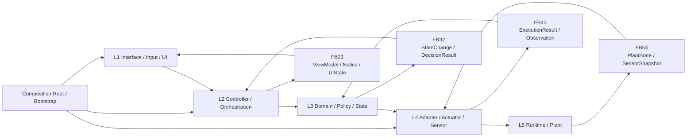

# 架构

本页保留当前仓库的两张基线图，以及一个关键子图：
- 自动控制架构图
- folder 映射图
- Skill Runtime Gateway 子图

## 1. 自动控制架构图

说明：
- 这张图表示逻辑控制流和反馈流。
- 前向控制严格按 `L1 -> L2 -> L3 -> L4 -> L5`。
- 反馈按 `L5 -> FB54 -> L4 -> FB43 -> L3 -> FB32 -> L2 -> FB21 -> L1` 回传。
- 纯 `L2/L3` 编排或 UI 状态变更，可以直接生成最近层级的 `FB21`，不伪造运行时观测。
- `Composition Root / Bootstrap` 只负责装配，不承载业务规则。

当前仓库主映射：

| 层级 | 当前 folder 映射 |
|---|---|
| `L1` | `Input/`、`UI/{HUD,SceneEditing,TaskGraph,SkillAllocation,Components,Setup}/Presentation/`、`UI/Core/Modal/` |
| `L2` | `Core/{Interaction,SceneGraph,TaskGraph,SkillAllocation,Command,Selection,Editing,AgentRuntime,Squad,EnvironmentCore,TempData,Camera,Comm,Config}/Application/`、`UI/Core/Application/`、`UI/Core/Modal/Application/`、`UI/HUD/Application/`、`UI/SceneEditing/Application/`、`UI/TaskGraph/Application/`、`UI/SkillAllocation/Application/`、`UI/Components/Application/`、`UI/Setup/Application/`、`Agent/{CharacterRuntime,Navigation,Sensing,Skill,StateTree}/Application/` |
| `L3` | `Core/{Interaction,SceneGraph,TaskGraph,SkillAllocation,Command,Selection,Editing,AgentRuntime,Squad,EnvironmentCore,TempData,Camera,Comm,Config}/Domain/`、`Core/{Interaction,SceneGraph,TaskGraph,SkillAllocation,Command,Selection,Editing,AgentRuntime,Squad,EnvironmentCore,TempData,Camera,Comm}/Feedback/`、`Core/Shared/Types/`、`UI/Core/Feedback/`、`UI/Core/Modal/Domain/`、`UI/HUD/{Domain,Feedback}/`、`UI/SceneEditing/{Domain,Feedback}/`、`UI/TaskGraph/{Domain,Feedback}/`、`UI/SkillAllocation/{Domain,Feedback}/`、`UI/Components/Domain/`、`UI/Setup/Domain/`、`Agent/{CharacterRuntime,Navigation,Sensing,Skill,StateTree}/{Domain,Feedback}/` |
| `L4` | `Core/{Interaction,SceneGraph,TaskGraph,SkillAllocation,Command,Selection,Editing,AgentRuntime,Squad,EnvironmentCore,TempData,Camera,Comm,Config}/Infrastructure/`、`UI/Core/Infrastructure/`、`UI/HUD/Infrastructure/`、`UI/SceneEditing/Infrastructure/`、`UI/TaskGraph/Infrastructure/`、`UI/SkillAllocation/Infrastructure/`、`UI/Components/Infrastructure/`、`UI/Setup/Infrastructure/`、`Agent/{CharacterRuntime,Navigation,Sensing,Skill,StateTree}/Infrastructure/` |
| `L5` | `Core/{SceneGraph,Command,Selection,Editing,AgentRuntime,Squad,TempData,EnvironmentCore,Camera,Comm,Config}/Runtime/`、`UI/{HUD,Setup,Components}/Runtime/`、`Agent/{CharacterRuntime,Navigation,Sensing,Skill,StateTree}/Runtime/`、`Environment/` |
| `CR` | `Core/{Interaction,SceneGraph,Command,Selection,Editing,AgentRuntime,Squad,EnvironmentCore,TempData,Camera,Comm,Config}/Bootstrap/`、`Core/GameFlow/Bootstrap/`、`UI/Core/Bootstrap/`、`UI/HUD/Bootstrap/`、`UI/SceneEditing/Bootstrap/`、`UI/TaskGraph/Bootstrap/`、`UI/SkillAllocation/Bootstrap/`、`UI/Components/Bootstrap/`、`UI/Setup/Bootstrap/`、`Agent/{CharacterRuntime,Navigation,Sensing,Skill,StateTree}/Bootstrap/` |

必要说明：
- `Core` 现在是 context 集合，不再存在 `Core/Manager` 和 `Core/Types` 大桶。
- `UI` 现在也按 context 收口：`Core / HUD / SceneEditing / TaskGraph / SkillAllocation / Components / Setup`，共享 modal 机制并入 `UI/Core/Modal/`。
- `UI` 现在和 `Core` 使用同一套结构语言：`Presentation/` 表示 UI 的 `L1` 展示壳，`Runtime/` 表示 UI 的 `L5` 入口壳。
- `Agent` 现在按 `CharacterRuntime / Navigation / Sensing / Skill / StateTree` 五个 context 收口，使用与 `Core/UI` 同一套层语义，但不包含 `Presentation/`。
- `Agent/Skill` 进一步收紧为 `Activation / Execution / Completion -> RuntimeGateway -> RuntimeHost`，并在 `Infrastructure` 里补了 `SceneGraph bridge`、`PIPCamera bridge`、`Config bridge`、`SearchPathBuilder`、`PlaceContextBuilder`，把对 `SceneGraphManager`、`PIPCameraManager`、`ConfigManager` 的直接访问压回少数桥文件，同时把 movement 参数处理拆成更窄的 `Navigate` / `AirOps` 文件，并把 `Search / Place` 的 runtime 实现再按 `Core / Waypoint / PIP`、`Core / Phases / Actions` 拆成多实现文件。
- `Agent/Navigation` 现在已把地面导航、manual fallback、ground follow、follow-start lifecycle、navigate/cancel request state、flight follow update、takeoff/land/return-home update 的纯决策收回 `Application`；`Runtime` 已按 `Lifecycle / Request / Flight / FlightCommand / FlightUpdate / Follow / FollowGround / Ground / Manual / Pause` 拆成执行壳。
- `Agent/CharacterRuntime` 现在已把 direct-control 状态迁移和 low-energy return 的暂停/恢复决策收回 `Application`；`Runtime` 已按 `Core / Control / Status / Sensor / Energy` 拆成执行壳，speech-bubble 的初始化、朝向和显示逻辑也已收回 `Infrastructure bridge`。
- `Agent/Sensing` 现在已把 action request 的参数解释收回 `Application`，`Runtime` 只保留 camera host；`MACameraSensorComponent` 也已按 `Core / Capture / Stream / Action` 拆成多个执行文件，stream start/stop 决策在 `Application`，listener socket create/cleanup/accept/send 在 `Infrastructure bridge`。
- `Agent/StateTree` 现在已把 task lifecycle 的通用决策收回 `Application`，`Runtime/Task` 主要负责节点入口；重复的 command-task enter/tick/exit 骨架已经统一收进 `MASTTaskUtils`。
- `Agent/StateTree` 的 `Charge` 任务现在不再自己做世界查询；最近充电站解析和导航投影已经下沉到 `Infrastructure bridge`。
- `TaskGraph`、`SkillAllocation` 属于轻量 context：没有专属 `Runtime/`，运行时持久化与传输仍由 `TempData / Comm` 承担。
- `Interaction` 也是轻量 context：没有专属 `Runtime/`，它负责编排其他 runtime context。

## 2. Folder 图

说明：
- 这张图表示 folder 落位与编译期依赖边界，不表示运行时控制流。
- 图中不显式绘制 `L4 -> L3` 的合同依赖边，因为那会和控制流方向混淆。
- 允许的是：`L4` 消费 `L3` 的状态、DTO、feedback 类型。
- 禁止的是：`L3 -> L4` 的实现依赖。

```mermaid
flowchart TB
    subgraph CR["Composition Root"]
        COREBOOT["Core/*/Bootstrap/"]
        GAMEFLOWBOOT["Core/GameFlow/Bootstrap/"]
        UIBOOT["UI/{Core,HUD,SceneEditing,TaskGraph,SkillAllocation,Components,Setup}/Bootstrap/"]
    end

    subgraph L1["L1 Entry / Presentation"]
        INPUT["Input/"]
        UIPRESENTATION["UI/*/Presentation/ + UI/Core/Modal/"]
    end

    subgraph L2["L2 Application"]
        COREAPP["Core/*/Application/"]
        AGENTAPP["Agent/*/Application/"]
        UICOREAPP["UI/Core/Application/"]
        UIMODALAPP["UI/Core/Modal/Application/"]
        UIHUDAPP["UI/HUD/Application/"]
        UIEDITAPP["UI/SceneEditing/Application/"]
        UITGAPP["UI/TaskGraph/Application/"]
        UISAAPP["UI/SkillAllocation/Application/"]
        UICOMPAPP["UI/Components/Application/"]
        UISETUPAPP["UI/Setup/Application/"]
    end

    subgraph L3["L3 Domain / Feedback"]
        COREDOMAIN["Core/*/Domain/"]
        COREFEEDBACK["Core/*/Feedback/"]
        AGENTDOMAIN["Agent/*/{Domain,Feedback}/"]
        SHAREDTYPES["Core/Shared/Types/"]
        UICOREFEEDBACK["UI/Core/Feedback/"]
        UIMODALDOMAIN["UI/Core/Modal/Domain/"]
        UIHUDDOMAIN["UI/HUD/{Domain,Feedback}/"]
        UIEDITDOMAIN["UI/SceneEditing/{Domain,Feedback}/"]
        UITGDOMAIN["UI/TaskGraph/{Domain,Feedback}/"]
        UISADOMAIN["UI/SkillAllocation/{Domain,Feedback}/"]
        UICOMPDOMAIN["UI/Components/Domain/"]
        UISETUPDOMAIN["UI/Setup/Domain/"]
    end

    subgraph L4["L4 Infrastructure"]
        COREINFRA["Core/*/Infrastructure/"]
        AGENTINFRA["Agent/*/Infrastructure/"]
        UICOREINFRA["UI/Core/Infrastructure/"]
        UIHUDINFRA["UI/HUD/Infrastructure/"]
        UIEDITINFRA["UI/SceneEditing/Infrastructure/"]
        UITGINFRA["UI/TaskGraph/Infrastructure/"]
        UISAINFRA["UI/SkillAllocation/Infrastructure/"]
        UICOMPINFRA["UI/Components/Infrastructure/"]
        UISETUPINFRA["UI/Setup/Infrastructure/"]
    end

    subgraph L5["L5 Runtime / Plant"]
        CORERUNTIME["Core/*/Runtime/ + UI/*/Runtime/"]
        AGENTRUNTIME["Agent/*/Runtime/"]
        ENV["Environment/"]
    end

    COREBOOT --> COREAPP
    GAMEFLOWBOOT --> INPUT
    GAMEFLOWBOOT --> UIPRESENTATION
    UIBOOT --> UIPRESENTATION

    INPUT --> COREAPP
    UIPRESENTATION --> UICOREAPP
    UIPRESENTATION --> UIHUDAPP
    UIPRESENTATION --> UIEDITAPP
    UIPRESENTATION --> UITGAPP
    UIPRESENTATION --> UISAAPP
    UIPRESENTATION --> UICOMPAPP
    UIPRESENTATION --> UISETUPAPP
    UIPRESENTATION --> UIMODALAPP

    COREAPP --> COREDOMAIN
    COREAPP --> COREFEEDBACK
    COREAPP --> SHAREDTYPES
    AGENTAPP --> AGENTDOMAIN

    UICOREAPP --> UICOREFEEDBACK
    UIMODALAPP --> UIMODALDOMAIN
    UIHUDAPP --> UIHUDDOMAIN
    UIEDITAPP --> UIEDITDOMAIN
    UITGAPP --> UITGDOMAIN
    UISAAPP --> UISADOMAIN
    UICOMPAPP --> UICOMPDOMAIN
    UISETUPAPP --> UISETUPDOMAIN

    COREINFRA --> CORERUNTIME
    COREINFRA --> AGENTRUNTIME
    COREINFRA --> ENV
    AGENTINFRA --> AGENTRUNTIME

    UICOREINFRA --> CORERUNTIME
    UIHUDINFRA --> CORERUNTIME
    UIHUDINFRA --> AGENTRUNTIME
    UIHUDINFRA --> ENV
    UIEDITINFRA --> CORERUNTIME
    UIEDITINFRA --> AGENTRUNTIME
    UIEDITINFRA --> ENV
    UITGINFRA --> CORERUNTIME
    UISAINFRA --> CORERUNTIME
    UICOMPINFRA --> CORERUNTIME
    UICOMPINFRA --> AGENTRUNTIME
    UICOMPINFRA --> ENV
    UISETUPINFRA --> CORERUNTIME
    UISETUPINFRA --> ENV
```

## 3. Skill Runtime Gateway

说明：
- 这张图只展开 `Agent/Skill` 这个 context。
- 目标是把 `Application` 和 `UMASkillComponent` 的内部细节隔开。
- `MASkillRuntimeGateway` 是 runtime 边界翻译层，不承载业务策略。
- `Application` 现在拆成三段：启动命令、执行编排、完成收尾。

```mermaid
flowchart LR
    classDef app fill:#e8f5e9,stroke:#2e7d32,color:#1b5e20
    classDef gateway fill:#e3f2fd,stroke:#1565c0,color:#0d47a1,stroke-width:2px
    classDef runtime fill:#fff3e0,stroke:#ef6c00,color:#e65100
    classDef ability fill:#f3e5f5,stroke:#6a1b9a,color:#4a148c
    classDef infra fill:#fce4ec,stroke:#ad1457,color:#880e4f

    CALLERS["CharacterRuntime / StateTree / Command"]:::app
    ACT["Skill/Application\nMASkillActivationUseCases"]:::app
    EXEC["Skill/Application\nMASkillExecutionUseCases"]:::app
    DONE["Skill/Application\nMASkillCompletionUseCases"]:::app
    GATE["Skill/Runtime\nMASkillRuntimeGateway"]:::gateway
    HOST["Skill/Runtime\nUMASkillComponent"]:::runtime
    ABILITY["Skill/Runtime/Impl\nSK_* abilities"]:::ability
    INFRA["Skill/Infrastructure\nSceneGraphBridge / PIPCameraBridge /\nConfigBridge / FeedbackGenerator /\nSceneGraphUpdater"]:::infra

    CALLERS --> ACT
    CALLERS --> EXEC
    ABILITY --> DONE

    ACT --> GATE
    EXEC --> ACT
    EXEC --> HOST
    DONE --> HOST
    DONE --> INFRA
    GATE --> HOST
    HOST --> ABILITY
```

当前落位：

| 角色 | 对应文件 |
|---|---|
| `Activation` | `Agent/Skill/Application/MASkillActivationUseCases.*` |
| `Execution` | `Agent/Skill/Application/MASkillExecutionUseCases.*` |
| `Completion` | `Agent/Skill/Application/MASkillCompletionUseCases.*` |
| `Runtime Gateway` | `Agent/Skill/Runtime/MASkillRuntimeGateway.*` |
| `Runtime Host` | `Agent/Skill/Runtime/MASkillComponent.*` |
| `Feedback / SceneGraph / Camera / Config` | `Agent/Skill/Infrastructure/MASkillSceneGraphBridge.*`、`Agent/Skill/Infrastructure/MASkillPIPCameraBridge.*`、`Agent/Skill/Infrastructure/MASkillConfigBridge.*`、`Agent/Skill/Infrastructure/MAFeedbackGenerator.*`、`Agent/Skill/Infrastructure/MASceneGraphUpdater.*` |
| `Ability 实现` | `Agent/Skill/Runtime/Impl/SK_*` |

当前约束：
- `ActivationUseCases` 只表达命令启动/取消意图，例如 `PrepareAndActivateNavigate`、`ActivatePreparedCommand`、`CancelCommand`。
- `ExecutionUseCases` 负责运行中编排，例如充电流程的“导航到站 -> 切换充电 -> 满电回 Idle”。
- `CompletionUseCases` 负责收尾，例如 command tag 清理、统一 `NotifySkillCompleted`、以及生成 completion feedback。
- `Runtime Gateway` 负责把命令翻译为 runtime 参数写入、ability handle 选择、底层激活与取消。
- `UMASkillComponent` 的 `Prepare*`、ability handle、底层 activate/cancel helper 已收回 `private`，只允许 `Bootstrap` 和 `RuntimeGateway` 通过 `friend` 访问。
- `Infrastructure` 现在通过 `MASkillSceneGraphBridge` 读取 scene graph snapshot / node lookup / landmark 查询，通过 `MASkillPIPCameraBridge` 访问 PIP camera runtime，并通过 `MASkillConfigBridge` 读取 follow/guide/observation skill 配置，避免把 `SceneGraphManager`、`PIPCameraManager`、`ConfigManager` 直接散落到 skill 文件里。

## 4. 当前结论

- `Core` 已经完成 context 化与 layer 化。
- `UI` 现在也已经完成同样的 context 化与 layer 化；剩余 runtime 边界只保留在刻意允许的入口壳，例如 `AMAHUD`、`AMASelectionHUD`。
- `Agent/Skill` 现在已经从“兼容包装壳”推进到“Activation / Execution / Completion + Gateway + RuntimeHost”结构，`Application` 不再直接触碰 runtime 内部句柄。
- `Agent/Skill` 的 `Search / Place` 现在也不再保留超大单实现文件；搜索已经拆成 `SK_Search.cpp + SK_Search.Waypoint.cpp + SK_Search.PIP.cpp`，搬运已经拆成 `SK_Place.cpp + SK_Place.Phases.cpp + SK_Place.Actions.cpp`，runtime 复杂度已落到按职责分块的状态。
- `Agent/Navigation` 现在不再把地面导航和飞行操作策略塞在 `Runtime`；`MANavigationUseCases` 已接管 ground request、manual update、ground follow refresh、follow start lifecycle、flight follow update、takeoff/land/return-home update、navigate/cancel request state 这些纯决策，`MANavigationService` 已拆成按职责分离的多个 runtime 执行文件。
- `Agent/CharacterRuntime` 现在不再把 direct-control、low-energy return 和 speech-bubble UI 联动塞在 `MACharacter.cpp`；状态迁移已经收回 `MACharacterRuntimeUseCases`，UI 组件细节也已收回 `MACharacterRuntimeBridge`，runtime 主壳已按 `Core / Control / Status / Sensor / Energy` 分离。
- `Agent/Sensing` 现在不再让 `MACameraSensorComponent::ExecuteAction` 自己解析 action 参数；参数解释由 `MASensingUseCases` 承担，camera runtime 也已拆成 `MACameraSensorComponent.cpp + .Capture.cpp + .Stream.cpp + .Action.cpp`。
- `Agent/StateTree` 现在不再只把 begin-play 放在 `Application`；`MAStateTreeUseCases` 已接管 command task enter/tick/exit、follow tick、place enter 这些通用生命周期决策，runtime task 的重复骨架也已集中到 `MASTTaskUtils`。
- `Agent/StateTree` 的 `Charge` 任务已经把充电站解析从 task runtime 挪到 `FMAStateTreeRuntimeBridge`。
- `Agent/Sensing` 的 stream lifecycle 已经开始拆成 `Application decision + Infrastructure bridge + Runtime host`；`MACameraSensorComponent` 不再自己处理 client accept/send。
- `Agent/Skill` 的 movement 参数预处理已继续从单个大桶拆成 `MASkillParamsProcessor.Movement.cpp` 与 `MASkillParamsProcessor.AirOps.cpp`，运行期 `SK_Place` 也已把重复的导航/动画分支收成统一 helper。
- `Bootstrap` 只允许被真正的入口壳或 bootstrap 层消费；`UI/*/Application/` 不再直接 include 其他 UI context 的 bootstrap。
- 架构守卫文件是：
  - `scripts/check_interaction_architecture.py`
- 新代码默认应复用本页这套 `L1-L5 + Feedback + Bootstrap` 骨架。
