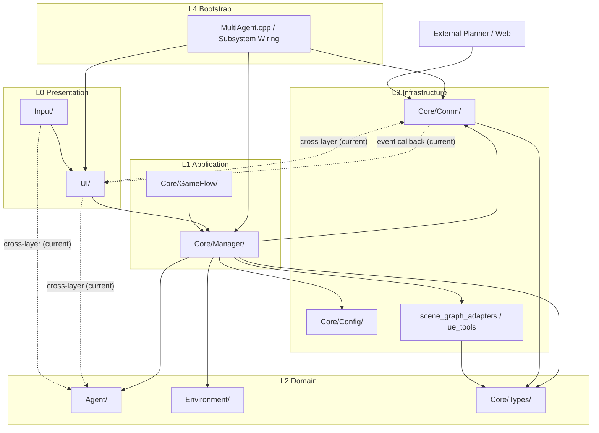
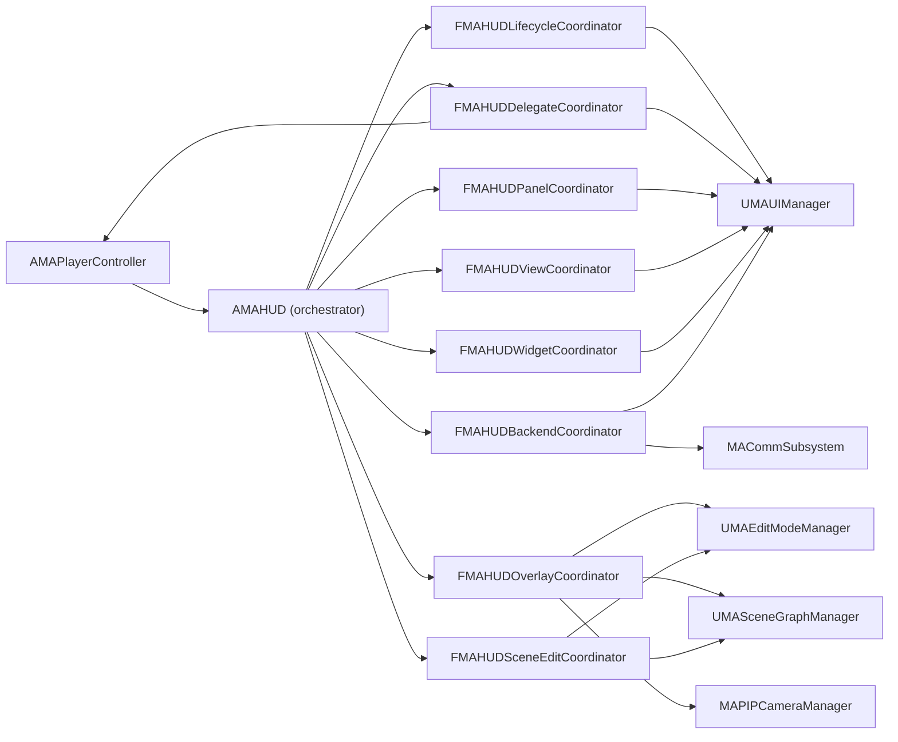
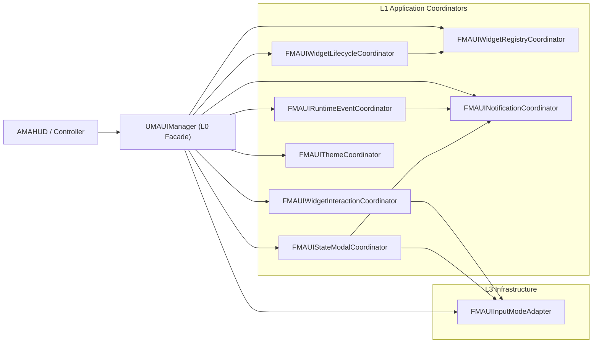
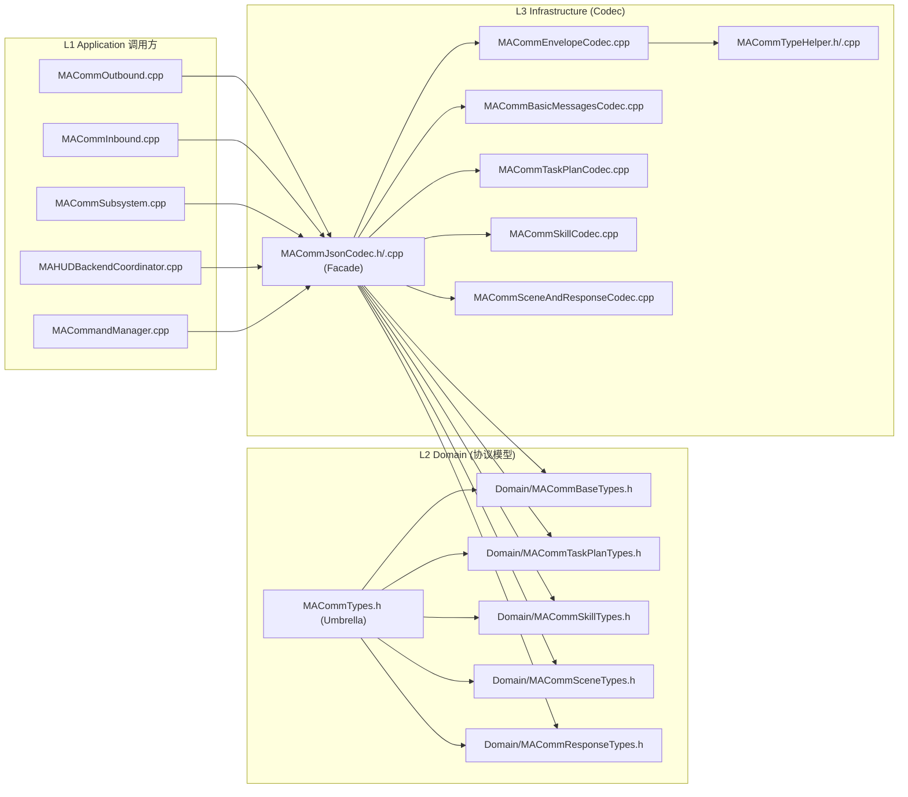

# 架构

本页目标：
- 快速看懂项目目录结构
- 明确“最底层”与“最上层（UI）”
- 用 2D 分层图理解模块关系

## 1. 项目文件夹 Tree（高层）

```text
MultiAgent-Unreal/
├── config/                     # 仿真配置（map_type、navigation、server 等）
├── datasets/                   # 场景图与示例数据
├── scripts/                    # Mock backend 与工具脚本
├── site_docs/                  # 对外文档站点（GitHub Pages 源）
├── unreal_project/
│   ├── Config/                 # UE 项目配置
│   ├── Content/                # 资源资产
│   └── Source/
│       └── MultiAgent/
│           ├── Core/           # 核心系统（通信、管理器、类型、配置）
│           ├── Agent/          # 机器人角色、技能、StateTree
│           ├── Environment/    # 环境实体/特效/场景辅助
│           ├── Input/          # 输入绑定与 PlayerController
│           ├── UI/             # HUD、Modal、TaskGraph、SkillAllocation
│           └── Utils/          # 通用工具
├── mac_compile_and_start.sh
└── README.md
```

## 2. `Source/MultiAgent` 详细 Tree（核心）

```text
unreal_project/Source/MultiAgent/
├── Core/
│   ├── Types/
│   ├── Config/
│   ├── Comm/
│   ├── GameFlow/
│   └── Manager/
│       ├── scene_graph_ports/
│       ├── scene_graph_adapters/
│       ├── scene_graph_services/
│       └── ue_tools/
├── Agent/
│   ├── Character/
│   ├── Component/
│   │   └── Sensor/
│   ├── Skill/
│   │   ├── Impl/
│   │   └── Utils/
│   └── StateTree/
│       ├── Task/
│       └── Condition/
├── Environment/
│   ├── Entity/
│   ├── Effect/
│   └── Utils/
├── Input/
├── UI/
│   ├── Core/
│   ├── HUD/
│   ├── Modal/
│   ├── Mode/
│   ├── TaskGraph/
│   ├── SkillAllocation/
│   │   └── Gantt/
│   ├── Components/
│   ├── Setup/
│   └── Legacy/
└── Utils/
```

## 3. 五层映射（按 L0~L4）

按你给出的 5 层模型，把当前代码先映射为：

| 层级 | 代码映射（当前） | 说明 |
|---|---|---|
| L0 Presentation | `UI/`（Widget/Modal/HUD 壳层）, `Input/` | 交互入口、HUD 壳层、按键鼠标事件 |
| L1 Application | `Core/Manager/`, `Core/GameFlow/`, `UI/HUD/Application/` | 用例编排、调度、Facade/协调逻辑 |
| L2 Domain | `Agent/`, `Environment/`, `Core/Types/` | 机器人/环境核心规则、状态与领域模型 |
| L3 Infrastructure | `Core/Comm/`, `Core/Config/`, `Core/Manager/scene_graph_adapters`, `Core/Manager/ue_tools` | HTTP/轮询、配置/文件、UE 适配器与外部依赖 |
| L4 Bootstrap | `MultiAgent.cpp` + Subsystem 初始化装配点 | 模块启动与依赖组装，不承载业务规则 |

当前判断：
- **最底层（业务意义）**：`L2 Domain`（`Agent/Environment/Core/Types`）
- **最上层（接近 UI）**：`L0 Presentation`（`UI/Input`）
- 备注：**目录位置不等于逻辑分层**，例如 `UI/HUD/Application` 物理上在 `UI/` 下，但逻辑职责属于 `L1 Application`（编排/协调）。

## 4. 2D 分层架构图（含跨层连接现状）

### 4.1 全局五层图（当前）



### 4.2 MAHUD 重构后内部图（当前）



### 4.3 UIManager 分层图（当前）



说明（本轮改动）：
- `CreateAllWidgets` 已拆成 `CreateHUD/CreatePlanner/CreateMode/CreatePanel/BindRuntimeEventSources` 五段，降低单函数复杂度。
- `UIManager` 新增受控写接口（`SetWidgetInstanceInternal`、`SetModalWidgetInternal`、`Register*Internal`、`Set*ThemeInternal`），用于收敛 coordinator 对私有字段的直接写入。
- `friend` 已清零；Coordinator 与 UIManager 的连接改为显式公开桥接接口（`SetInputMode*` + `On*` 委托回调）。
- `WidgetInteractionCoordinator` 已移除对 `UIManager` 私有字段直连，仅通过 `Get*` 接口访问状态。

### 4.4 Comm 协议层拆分图（当前）



## 5. 重构建议

### 5.1 总体原则

- 图中的**实线**是目标依赖方向（推荐长期保留）。
- 图中的**虚线**是当前项目里已存在的跨层直连（本页保留展示，不做粉饰）。
- 如果后续要做“严格五层”，优先消除 `L0 -> L2/L3` 的直连，把入口收敛到 `L1`。

### 5.2 优先级清单（建议）

| 优先级 | 主题 | 涉及模块 | 重构动作 | 目标收益 |
|---|---|---|---|---|
| P0 | UI 入口解耦（持续） | `UI/HUD/MAHUD.cpp` + `UI/HUD/Application/*` + `UI/Core/MAUIManager.*` | MAHUD 与 UIManager 均已完成 Coordinator 化；UIManager 已完成 `friend` 清零、显式回调桥接与私有字段直连清理 | 降低 UI 变更连锁影响 |
| P0 | 调度核心收口 | `Core/Manager/MASceneGraphManager.cpp` | 保持外部 API 稳定，内部继续通过 ports/adapters 隔离实现细节 | 防止回耦，稳定跨模块调用 |
| P0 | 导航状态显式化 | `Agent/Component/MANavigationService*.cpp` | 将 Pause/Resume/Cleanup 等状态切换统一到 transition helper | 降低分支散落与遗漏风险 |
| P0 | `Utils` 拆层 | `Utils/MAPathPlanner*` `Utils/MAFlightController*` | 领域规则下沉到 `L2 Domain`，UE `World/Trace/Overlap` 访问上提到 `L3 Adapter` | 提升可测试性与可替换性 |
| P1 | 画布交互解耦 | `UI/SkillAllocation/MAGanttCanvas.cpp` | 将 `NativeOnMouseDown/Move/Up` 收敛到 DragController，Canvas 仅做编排 | 降低 UI 复杂度，便于迭代 |
| P1 | 通信类型治理（已完成第一阶段） | `Core/Comm/MACommTypes.*` | 已完成 Domain 拆头 + Codec 下沉；下一步可补 DTO 校验与版本字段 | 减少前后端联调破坏 |
| P1 | 架构守卫 | CI / 静态检查 | 增加 include 与层间依赖规则，禁止新增 `L0 -> L2/L3` 直连 | 防止重构成果回退 |

通信类型治理（当前进展，2026-03-08）：
- `MACommTypes.h` 已改为 umbrella，仅聚合 `Domain/MAComm*Types.h` 五个子头；原单体头中的模型方法声明已移除。
- 原 `MACommTypes.cpp` 已删除；编解码能力下沉到 `Core/Comm/Infrastructure/Codec/*.cpp`（Envelope / Basic / TaskPlan / Skill / Scene+Response / TypeHelper）。
- `LogMACommTypes` 与消息枚举映射策略集中到 `MACommTypeHelper.cpp`，避免重复定义与分散维护。
- `MACommOutbound` / `MACommSubsystem` / `MACommInbound` / `MAHUDBackendCoordinator` 已统一通过 `MACommJsonCodec` 门面访问序列化逻辑。
- `MACommandManager` 中 `SkillList` 时间步查询已改为 `MACommJsonCodec::FindSkillListTimeStep`，保持模型层“纯数据结构”定位。

### 5.3 执行顺序建议

1. 先做全部 P0（控制复杂度和耦合主风险）。
2. 再做 P1（提高演进效率和长期稳定性）。
3. 每完成一个主题，更新本页架构图中的连线关系，保持文档与代码同步。
