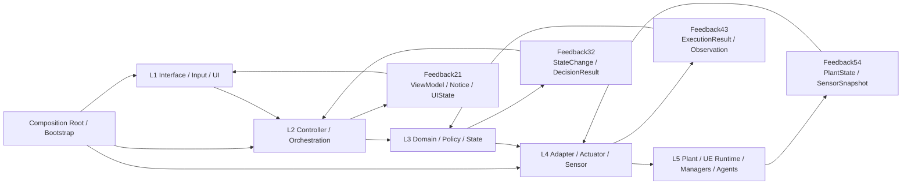

# 架构

本页只保留当前仓库最重要的两张图：
- 自动控制架构图
- folder 依赖图

目标是快速回答两个问题：
- 运行时控制链怎么走
- 代码目录的依赖边界怎么划

## 1. 自动控制架构图（当前基线）

说明：
- 这张图表示**逻辑控制流 / 反馈流**。
- 前向控制严格按 `L1 -> L2 -> L3 -> L4 -> L5`。
- 当动作真正触达运行时系统时，反馈按 `L5 -> FB54 -> L4 -> FB43 -> L3 -> FB32 -> L2 -> FB21 -> L1` 回传。
- 纯 `L2/L3` 编排或 UI 状态变更，可以从最近层级直接产生 `FB21`，不需要伪造 `L5` 观测。
- `Composition Root / Bootstrap` 只负责装配，不承载业务规则。

当前仓库的主映射：

| 层级 | 当前 folder 映射 |
|---|---|
| `L1` | `Input/`、`UI/` |
| `L2` | `Core/Interaction/Application/`、`Core/SceneGraph/Application/`、`Core/TaskGraph/Application/`、`Core/SkillAllocation/Application/`、`Core/Command/Application/`、`Core/Selection/Application/`、`Core/Editing/Application/`、`Core/AgentRuntime/Application/`、`Core/Squad/Application/`、`Core/EnvironmentCore/Application/`、`Core/TempData/Application/`、`Core/Camera/Application/`、`Core/Comm/Application/`、`Core/Config/Application/`、`UI/Core/Application/`、`UI/Core/Modal/Application/`、`UI/HUD/Application/`、`UI/SceneEditing/Application/`、`UI/TaskGraph/Application/`、`UI/SkillAllocation/Application/`、`UI/Components/Application/`、`UI/Setup/Application/` |
| `L3` | `Core/Interaction/Domain/`、`Core/Interaction/Feedback/`、`Core/SceneGraph/Domain/`、`Core/SceneGraph/Feedback/`、`Core/TaskGraph/Domain/`、`Core/TaskGraph/Feedback/`、`Core/SkillAllocation/Domain/`、`Core/SkillAllocation/Feedback/`、`Core/Command/Domain/`、`Core/Command/Feedback/`、`Core/Selection/Domain/`、`Core/Selection/Feedback/`、`Core/Editing/Domain/`、`Core/Editing/Feedback/`、`Core/AgentRuntime/Domain/`、`Core/AgentRuntime/Feedback/`、`Core/Squad/Domain/`、`Core/Squad/Feedback/`、`Core/EnvironmentCore/Domain/`、`Core/EnvironmentCore/Feedback/`、`Core/TempData/Domain/`、`Core/TempData/Feedback/`、`Core/Camera/Domain/`、`Core/Camera/Feedback/`、`Core/Comm/Domain/`、`Core/Comm/Feedback/`、`Core/Config/Domain/`、`Core/Shared/Types/`、`UI/HUD/Domain/`、`UI/SceneEditing/Domain/`、`UI/TaskGraph/Domain/`、`UI/SkillAllocation/Domain/`、`UI/Components/Domain/`、`UI/Setup/Domain/`、`UI/Core/Modal/Domain/` |
| `L4` | `Core/Interaction/Infrastructure/`、`Core/SceneGraph/Infrastructure/`、`Core/TaskGraph/Infrastructure/`、`Core/SkillAllocation/Infrastructure/`、`Core/Command/Infrastructure/`、`Core/Selection/Infrastructure/`、`Core/Editing/Infrastructure/`、`Core/AgentRuntime/Infrastructure/`、`Core/Squad/Infrastructure/`、`Core/EnvironmentCore/Infrastructure/`、`Core/TempData/Infrastructure/`、`Core/Camera/Infrastructure/`、`Core/Comm/Infrastructure/`、`Core/Config/Infrastructure/`、`UI/Core/Infrastructure/`、`UI/HUD/Infrastructure/`、`UI/SceneEditing/Infrastructure/`、`UI/TaskGraph/Infrastructure/`、`UI/SkillAllocation/Infrastructure/`、`UI/Components/Infrastructure/`、`UI/Setup/Infrastructure/` |
| `L5` | `Core/SceneGraph/Runtime/`、`Core/Camera/Runtime/`、`Core/Editing/Runtime/`、`Core/Selection/Runtime/`、`Core/Command/Runtime/`、`Core/AgentRuntime/Runtime/`、`Core/Squad/Runtime/`、`Core/TempData/Runtime/`、`Core/EnvironmentCore/Runtime/`、`Core/Comm/Runtime/`、`Core/Config/Runtime/`、`Agent/`、`Environment/` |
| `CR` | `Core/Interaction/Bootstrap/`、`Core/SceneGraph/Bootstrap/`、`Core/Command/Bootstrap/`、`Core/Selection/Bootstrap/`、`Core/Editing/Bootstrap/`、`Core/AgentRuntime/Bootstrap/`、`Core/Squad/Bootstrap/`、`Core/EnvironmentCore/Bootstrap/`、`Core/TempData/Bootstrap/`、`Core/Camera/Bootstrap/`、`Core/Comm/Bootstrap/`、`Core/Config/Bootstrap/`、`Core/GameFlow/Bootstrap/` |

补充：
- `Core/Interaction/Feedback/` 现在同时承载 feedback 合同类型和纯 feedback 翻译逻辑，例如 `MAFeedbackPipeline`。
- `Core/Interaction/Infrastructure/` 应只保留真正触达 Unreal runtime / HUD / Manager 的 adapter 与 applier。
- `Core/Interaction/Application/` 不再直接 include `Infrastructure`；运行时访问统一经由 `PlayerController / Bootstrap` 的桥接入口转发。
- `Core/SceneGraph/` 现在是独立上下文，不再继续把 SceneGraph 类型、服务、工具和 UE 同步逻辑塞回 `Core/Manager/`；`Feedback/` 负责标准化查询与变更结果，`Bootstrap/` 负责统一解析 `UMASceneGraphManager` 与只读查询入口。
- `Core/Camera/` 现在承载 `PIP / ExternalCamera / Viewport` 这一组相机能力；`MAPIPCameraTypes` 也已从 `Core/Types/` 迁入 `Core/Camera/Domain/`。
- `Core/Editing/` 目前已先把 `MAEditModeManager` 抽到 `Runtime/`，用于承接 UI 编辑流程与 SceneGraph 之间的运行时桥接。
- `Core/Selection/` 目前已先把 `MASelectionManager` 抽到 `Runtime/`，用于承接框选、编组和选中态运行时同步。
- `Core/Command/` 目前已先把 `MACommandManager` 抽到 `Runtime/`，用于承接技能列表执行、暂停恢复、运行时检查和 Python 反馈发送。
- `Core/AgentRuntime/`、`Core/Squad/`、`Core/TempData/`、`Core/EnvironmentCore/` 已从 `Core/Manager/` 中拆出，当前 `Core/Manager/` 不再承载正式运行时代码。
- `Core/Shared/Types/` 现在承载跨上下文共享的纯合同类型；原 `Core/Types/` 已退休。
- `Core/TaskGraph/` 现在已经补齐 `Application / Feedback`，并把 JSON codec 从 domain 类型中剥离到 `Infrastructure/`；默认模板和 mock 示例路径也已从 `Bootstrap` 移回 `Application`，因此它现在是一个**无专属 Runtime、无专属 Bootstrap 的轻量 context**，运行时持久化与传输仍分别由 `TempData / Comm` 承担。
- `Core/SkillAllocation/` 现在已经补齐 `Application / Feedback`，并把 skill-list 构建与 JSON 解析统一收回该 context；空数据默认值也已从 `Bootstrap` 移回 `Application`，因此它和 `TaskGraph` 一样属于**无专属 Runtime、无专属 Bootstrap 的轻量 context**，运行时持久化与分发仍分别由 `TempData / Comm` 承担。
- `UI/TaskGraph/` 现在也建立了本地 `Application / Domain / Infrastructure` 支撑层：`MATaskPlannerWidget` 通过 coordinator + runtime adapter 驱动任务图加载/保存/提交，`MADAGCanvasWidget` 的视口状态、自动布局和几何计算已从 widget 主体中拆开。
- `UI/SkillAllocation/` 现在也建立了本地 `Application / Domain / Infrastructure` 支撑层：`MASkillAllocationViewer` 通过 coordinator + runtime adapter 驱动技能分配加载、保存、导航和运行时事件绑定，viewer 自身不再直接访问 `TempData / UIManager / HUD`；`Gantt` 相关辅助类型也已按 `Application / Domain / Infrastructure` 物理落位，不再保留独立的 `UI/SkillAllocation/Gantt/` 大桶。
- `UI/Components/` 现在也开始沿同一模式收口：`MATaskGraphPreview` 和 `MASkillListPreview` 的数据构建与布局计算已分别下沉到 `Application / Domain / Infrastructure`，`MAPreviewPanel` 保持为薄容器。
- `UI/Components/` 的 runtime-heavy 组件也已按同一模式收口：`MAMiniMapWidget / MAMiniMapManager / MAInstructionPanel` 的运行时采样、点击跳转和 post-submit 行为已下沉到各自的 `Infrastructure` 与 `Application` 协调器。
- `UI/Components/` 的剩余小组件现在也已收口：`MAContextMenuWidget / MANotificationWidget / MASystemLogPanel / MADirectControlIndicator` 已具备明确的 `Application / Domain` 支撑层，其中日志与通知状态编排、主题模型、菜单布局与点击关闭规则都已离开 widget 主体。
- 纯视觉小组件 `MASpeechBubbleWidget / MAStyledButton` 也已按轻量模式拆分：保留 widget 展示壳，并将动画/颜色/状态步进下沉到 `Application + Domain`，因为它们不直接触达 runtime，所以不额外引入 `Infrastructure`。
- `UI/Core/` 现在继续承接 UI 根级流程，但 `Application` 已不再直接 include `TempData / Comm / Command` 运行时代码；这些访问统一经由 `UI/Core/Infrastructure/MAUIRuntimeBridge` 进入运行时。
- `UI/HUD/MASelectionHUD` 现在只负责绘制；全屏 widget 判定、Agent/Selection 查询、控制组统计和状态文本投影统一经由 `UI/HUD/Application/MASelectionHUDCoordinator` 与 `UI/HUD/Infrastructure/MASelectionHUDRuntimeAdapter` 提供。
- `UI/Setup/` 现在已经形成独立轻量 setup context：`MASetupHUD / MASetupWidget` 只保留展示与输入，配置读取、关卡启动、输入模式切换和启动请求组装都已下沉到 `Application / Infrastructure / Bootstrap`。
- 共享 modal 机制现在并入 `UI/Core/Modal/`：`MABaseModalWidget` 与 `MADecisionModal` 留在 `UI/Core/Modal`，动画步进、按钮模型和全局 HITL modal 规则统一由 `UI/Core/Modal/Application + Domain` 承载。
- `UI/SceneEditing/` 的根 widget 现在也收口了最后一批 runtime 痕迹：`MAModifyWidget / MASceneListWidget` 通过本地 `Application + Infrastructure` 协调器访问 `SceneGraph / Editing`，widget 壳不再直接 include runtime 或 bootstrap。
- `UI/TaskGraph/MATaskGraphModal` 与 `UI/SkillAllocation/MASkillAllocationModal` 现在已经归还给各自 owner context；它们保留为薄 modal 壳，具体数据流分别经 `UI/TaskGraph`、`UI/SkillAllocation` 和对应 `Core` context 处理。
- `Core/Squad/` 现在已经补齐 `Application / Feedback / Infrastructure / Bootstrap`，`Interaction` 不再自己拼 squad 文案或直接解析 `UMASquadManager`，而是统一经由 `Squad` context 的 runtime bridge 返回标准反馈。
- `Core/Comm/` 现在已经补齐 `Application / Feedback / Runtime / Bootstrap`，不再把通信入口文件平铺在 context 根目录。
- `Core/Config/` 现在保留 `MAConfigManager.h` 作为统一外部入口；内部的配置类型、加载用例、路径解析和 JSON 读取已下沉到 `Domain / Application / Infrastructure / Runtime / Bootstrap`。
- `Core/GameFlow/` 现在明确定位为 **Bootstrap shell**，只承载地图启动、Setup 流程和引擎级装配，不作为完整业务 context 继续扩张。
- `Core/Camera/` 当前主要落在 `Domain / Infrastructure / Runtime`；后续如果出现更明确的相机 workflow，再补 `Application / Feedback / Bootstrap`。

## 2. Folder 图（当前实现）

说明：
- 这张图现在改成**层级归属图**，重点表达 folder 落位，不再试图完整表达所有编译期依赖。
- 为避免和控制流方向混淆，图中**不显式绘制** `L4 -> L3` 这类“Infrastructure 依赖 Domain/Feedback 合同类型”的边。
- 需要记住的规则仍然是：
  - `L3 -> L4` 禁止
  - `L4` 可以消费 `L3` 的状态 / DTO / feedback 类型
  - 这类合同依赖保留在说明里，不放进图里制造反向视觉噪音

```mermaid
flowchart TB
    subgraph CR["Composition Root"]
        BOOT["Core/Interaction/Bootstrap/"]
        CTXBOOT["Core/*/Bootstrap/"]
        SGBOOT["Core/SceneGraph/Bootstrap/"]
    end

    subgraph L1["L1 Entry / Presentation"]
        INPUT["Input/"]
        UIHUD["UI/HUD/"]
        UIMODE["UI/SceneEditing/"]
        UICORE["UI/Core/"]
    end

    subgraph L2["L2 Application"]
        INTAPP["Core/Interaction/Application/"]
        SGAPP["Core/SceneGraph/Application/"]
        TASKGRAPHAPP["Core/TaskGraph/Application/"]
        CTXAPP["Core/{Command,Selection,Editing,AgentRuntime,Squad,EnvironmentCore,TempData,Camera,Comm,Config,SkillAllocation}/Application/"]
        UICOREAPP["UI/Core/Application/"]
        HUDAPP["UI/HUD/Application/"]
        MODEAPP["UI/SceneEditing/Application/"]
        SETUPAPP["UI/Setup/Application/"]
        COREMODALAPP["UI/Core/Modal/Application/"]
    end

    subgraph L3["L3 Domain / Feedback"]
        INTDOMAIN["Core/Interaction/Domain/"]
        FEEDBACK["Core/Interaction/Feedback/"]
        SGDOMAIN["Core/SceneGraph/Domain/"]
        SGFB["Core/SceneGraph/Feedback/"]
        CTXDOMAIN["Core/{Command,Selection,Editing,AgentRuntime,Squad,EnvironmentCore,TempData,Camera,Comm,Config,SkillAllocation}/Domain/"]
        CTXFB["Core/{Command,Selection,Editing,AgentRuntime,Squad,EnvironmentCore,TempData,Camera,Comm,SkillAllocation}/Feedback/"]
        TASKGRAPHDOMAIN["Core/TaskGraph/Domain/"]
        TASKGRAPHFB["Core/TaskGraph/Feedback/"]
        SHAREDTYPES["Core/Shared/Types/"]
        HUDDOMAIN["UI/HUD/Domain/"]
        MODEDOMAIN["UI/SceneEditing/Domain/"]
        SETUPDOMAIN["UI/Setup/Domain/"]
        COREMODALDOMAIN["UI/Core/Modal/Domain/"]
    end

    subgraph L4["L4 Infrastructure"]
        INTINFRA["Core/Interaction/Infrastructure/"]
        SGINFRA["Core/SceneGraph/Infrastructure/"]
        CTXINFRA["Core/{Command,Selection,Editing,AgentRuntime,Squad,EnvironmentCore,TempData,Camera,Comm,Config,SkillAllocation}/Infrastructure/"]
        TASKGRAPHINFRA["Core/TaskGraph/Infrastructure/"]
        SKILLALLOCINFRA["Core/SkillAllocation/Infrastructure/"]
        UICOREINFRA["UI/Core/Infrastructure/"]
        HUDINFRA["UI/HUD/Infrastructure/"]
        MODEINFRA["UI/SceneEditing/Infrastructure/"]
        SETUPINFRA["UI/Setup/Infrastructure/"]
    end

    subgraph L5["L5 Plant / Runtime"]
        SGRUNTIME["Core/SceneGraph/Runtime/"]
        CTXRUNTIME["Core/{Camera,Editing,Selection,Command,AgentRuntime,Squad,TempData,EnvironmentCore,Comm,Config}/Runtime/"]
        AGENT["Agent/"]
        ENV["Environment/"]
    end

    BOOT --> INPUT
    BOOT --> INTAPP
    BOOT --> INTINFRA
    SGBOOT --> SGAPP
    SGBOOT --> SGINFRA
    CTXBOOT --> CTXAPP
    CTXBOOT --> CTXINFRA
    CTXBOOT --> TASKGRAPHAPP

    INPUT --> INTAPP

    UICORE --> UIHUD
    UICORE --> UIMODE
    UICORE --> UICOREAPP
    UICORE --> SETUPAPP
    UICORE --> COREMODALAPP
    UIHUD --> HUDAPP
    UIMODE --> MODEAPP
    INTAPP --> SGAPP
    INTAPP --> CTXAPP
    INTAPP --> TASKGRAPHAPP
    HUDAPP --> SGAPP
    MODEAPP --> SGAPP
    HUDAPP --> TASKGRAPHAPP
    MODEAPP --> TASKGRAPHAPP

    INTAPP --> INTDOMAIN
    INTAPP --> FEEDBACK
    SGAPP --> SGDOMAIN
    SGAPP --> SGFB
    CTXAPP --> CTXDOMAIN
    CTXAPP --> CTXFB
    TASKGRAPHAPP --> TASKGRAPHDOMAIN
    TASKGRAPHAPP --> TASKGRAPHFB
    HUDAPP --> HUDDOMAIN
    HUDAPP --> MODEAPP
    HUDAPP --> FEEDBACK

    MODEAPP --> MODEDOMAIN
    SETUPAPP --> SETUPDOMAIN
    COREMODALAPP --> COREMODALDOMAIN

    SGINFRA --> SGRUNTIME
    CTXINFRA --> CTXRUNTIME
    UICOREINFRA --> CTXRUNTIME

    INTINFRA --> CTXRUNTIME
    INTINFRA --> AGENT
    INTINFRA --> ENV

    HUDINFRA --> CTXRUNTIME
    HUDINFRA --> AGENT
    HUDINFRA --> ENV

    MODEINFRA --> CTXRUNTIME
    MODEINFRA --> AGENT
    MODEINFRA --> ENV

    SETUPINFRA --> CTXRUNTIME
    SETUPINFRA --> ENV
```

## 3. 必要说明

- 当前仓库已经把 `Input` 主线收敛到 `Core/Interaction/*`，`PlayerController` 主要保留入口职责。
- `UI/HUD/Application` 与 `UI/SceneEditing/Application` 已经去掉直接 `GetWorld/GetSubsystem` 和 `Infrastructure` include，运行时访问统一经由 `AMAHUD / Widget / PlayerController` 的桥接入口转发。
- `FB21` 已是统一 UI 反馈通道；命令派发链路已走通完整 `FB54 -> FB43 -> FB32 -> FB21`。
- `scripts/check_interaction_architecture.py` 是架构守卫，用来阻止层级回退。
- 如果后续继续重构，新代码默认应复用本页这套 `L1-L5 + Feedback + Bootstrap` 骨架，而不是再新开平行通道。
