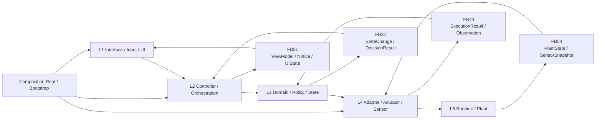

# 架构

本页只保留当前仓库的两张基线图：
- 自动控制架构图
- folder 映射图

## 1. 自动控制架构图

说明：
- 这张图表示逻辑控制流和反馈流。
- 前向控制严格按 `L1 -> L2 -> L3 -> L4 -> L5`。
- 反馈按 `L5 -> FB54 -> L4 -> FB43 -> L3 -> FB32 -> L2 -> FB21 -> L1` 回传。
- 纯 `L2/L3` 编排或 UI 状态变更，可以直接生成最近层级的 `FB21`，不伪造运行时观测。
- `Composition Root / Bootstrap` 只负责装配，不承载业务规则。

当前仓库主映射：

| 层级 | 当前 folder 映射 |
|---|---|
| `L1` | `Input/`、`UI/` |
| `L2` | `Core/{Interaction,SceneGraph,TaskGraph,SkillAllocation,Command,Selection,Editing,AgentRuntime,Squad,EnvironmentCore,TempData,Camera,Comm,Config}/Application/`、`UI/Core/Application/`、`UI/Core/Modal/Application/`、`UI/HUD/Application/`、`UI/SceneEditing/Application/`、`UI/TaskGraph/Application/`、`UI/SkillAllocation/Application/`、`UI/Components/Application/`、`UI/Setup/Application/` |
| `L3` | `Core/{Interaction,SceneGraph,TaskGraph,SkillAllocation,Command,Selection,Editing,AgentRuntime,Squad,EnvironmentCore,TempData,Camera,Comm,Config}/Domain/`、`Core/{Interaction,SceneGraph,TaskGraph,SkillAllocation,Command,Selection,Editing,AgentRuntime,Squad,EnvironmentCore,TempData,Camera,Comm}/Feedback/`、`Core/Shared/Types/`、`UI/Core/Feedback/`、`UI/Core/Modal/Domain/`、`UI/HUD/{Domain,Feedback}/`、`UI/SceneEditing/{Domain,Feedback}/`、`UI/TaskGraph/{Domain,Feedback}/`、`UI/SkillAllocation/{Domain,Feedback}/`、`UI/Components/Domain/`、`UI/Setup/Domain/` |
| `L4` | `Core/{Interaction,SceneGraph,TaskGraph,SkillAllocation,Command,Selection,Editing,AgentRuntime,Squad,EnvironmentCore,TempData,Camera,Comm,Config}/Infrastructure/`、`UI/Core/Infrastructure/`、`UI/HUD/Infrastructure/`、`UI/SceneEditing/Infrastructure/`、`UI/TaskGraph/Infrastructure/`、`UI/SkillAllocation/Infrastructure/`、`UI/Components/Infrastructure/`、`UI/Setup/Infrastructure/` |
| `L5` | `Core/{SceneGraph,Command,Selection,Editing,AgentRuntime,Squad,TempData,EnvironmentCore,Camera,Comm,Config}/Runtime/`、`Agent/`、`Environment/` |
| `CR` | `Core/{Interaction,SceneGraph,Command,Selection,Editing,AgentRuntime,Squad,EnvironmentCore,TempData,Camera,Comm,Config}/Bootstrap/`、`Core/GameFlow/Bootstrap/`、`UI/Core/Bootstrap/`、`UI/HUD/Bootstrap/`、`UI/SceneEditing/Bootstrap/`、`UI/TaskGraph/Bootstrap/`、`UI/SkillAllocation/Bootstrap/`、`UI/Components/Bootstrap/`、`UI/Setup/Bootstrap/` |

必要说明：
- `Core` 现在是 context 集合，不再存在 `Core/Manager` 和 `Core/Types` 大桶。
- `UI` 现在也按 context 收口：`Core / HUD / SceneEditing / TaskGraph / SkillAllocation / Components / Setup`，共享 modal 机制并入 `UI/Core/Modal/`。
- `TaskGraph`、`SkillAllocation` 属于轻量 context：没有专属 `Runtime/`，运行时持久化与传输仍由 `TempData / Comm` 承担。
- `Interaction` 也是轻量 context：没有专属 `Runtime/`，它负责编排其他 runtime context。

## 2. Folder 图

说明：
- 这张图表示 folder 落位与编译期依赖边界，不表示运行时控制流。
- 图中不显式绘制 `L4 -> L3` 的合同依赖边，因为那会和控制流方向混淆。
- 允许的是：`L4` 消费 `L3` 的状态、DTO、feedback 类型。
- 禁止的是：`L3 -> L4` 的实现依赖。

```mermaid
flowchart TB
    subgraph CR["Composition Root"]
        COREBOOT["Core/*/Bootstrap/"]
        GAMEFLOWBOOT["Core/GameFlow/Bootstrap/"]
        UIBOOT["UI/{Core,HUD,SceneEditing,TaskGraph,SkillAllocation,Components,Setup}/Bootstrap/"]
    end

    subgraph L1["L1 Entry / Presentation"]
        INPUT["Input/"]
        UIROOT["UI/"]
    end

    subgraph L2["L2 Application"]
        COREAPP["Core/*/Application/"]
        UICOREAPP["UI/Core/Application/"]
        UIMODALAPP["UI/Core/Modal/Application/"]
        UIHUDAPP["UI/HUD/Application/"]
        UIEDITAPP["UI/SceneEditing/Application/"]
        UITGAPP["UI/TaskGraph/Application/"]
        UISAAPP["UI/SkillAllocation/Application/"]
        UICOMPAPP["UI/Components/Application/"]
        UISETUPAPP["UI/Setup/Application/"]
    end

    subgraph L3["L3 Domain / Feedback"]
        COREDOMAIN["Core/*/Domain/"]
        COREFEEDBACK["Core/*/Feedback/"]
        SHAREDTYPES["Core/Shared/Types/"]
        UICOREFEEDBACK["UI/Core/Feedback/"]
        UIMODALDOMAIN["UI/Core/Modal/Domain/"]
        UIHUDDOMAIN["UI/HUD/{Domain,Feedback}/"]
        UIEDITDOMAIN["UI/SceneEditing/{Domain,Feedback}/"]
        UITGDOMAIN["UI/TaskGraph/{Domain,Feedback}/"]
        UISADOMAIN["UI/SkillAllocation/{Domain,Feedback}/"]
        UICOMPDOMAIN["UI/Components/Domain/"]
        UISETUPDOMAIN["UI/Setup/Domain/"]
    end

    subgraph L4["L4 Infrastructure"]
        COREINFRA["Core/*/Infrastructure/"]
        UICOREINFRA["UI/Core/Infrastructure/"]
        UIHUDINFRA["UI/HUD/Infrastructure/"]
        UIEDITINFRA["UI/SceneEditing/Infrastructure/"]
        UITGINFRA["UI/TaskGraph/Infrastructure/"]
        UISAINFRA["UI/SkillAllocation/Infrastructure/"]
        UICOMPINFRA["UI/Components/Infrastructure/"]
        UISETUPINFRA["UI/Setup/Infrastructure/"]
    end

    subgraph L5["L5 Runtime / Plant"]
        CORERUNTIME["Core/*/Runtime/"]
        AGENT["Agent/"]
        ENV["Environment/"]
    end

    COREBOOT --> COREAPP
    GAMEFLOWBOOT --> INPUT
    GAMEFLOWBOOT --> UIROOT
    UIBOOT --> UIROOT

    INPUT --> COREAPP
    UIROOT --> UICOREAPP
    UIROOT --> UIHUDAPP
    UIROOT --> UIEDITAPP
    UIROOT --> UITGAPP
    UIROOT --> UISAAPP
    UIROOT --> UICOMPAPP
    UIROOT --> UISETUPAPP
    UIROOT --> UIMODALAPP

    COREAPP --> COREDOMAIN
    COREAPP --> COREFEEDBACK
    COREAPP --> SHAREDTYPES

    UICOREAPP --> UICOREFEEDBACK
    UIMODALAPP --> UIMODALDOMAIN
    UIHUDAPP --> UIHUDDOMAIN
    UIEDITAPP --> UIEDITDOMAIN
    UITGAPP --> UITGDOMAIN
    UISAAPP --> UISADOMAIN
    UICOMPAPP --> UICOMPDOMAIN
    UISETUPAPP --> UISETUPDOMAIN

    COREINFRA --> CORERUNTIME
    COREINFRA --> AGENT
    COREINFRA --> ENV

    UICOREINFRA --> CORERUNTIME
    UIHUDINFRA --> CORERUNTIME
    UIHUDINFRA --> AGENT
    UIHUDINFRA --> ENV
    UIEDITINFRA --> CORERUNTIME
    UIEDITINFRA --> AGENT
    UIEDITINFRA --> ENV
    UITGINFRA --> CORERUNTIME
    UISAINFRA --> CORERUNTIME
    UICOMPINFRA --> CORERUNTIME
    UICOMPINFRA --> AGENT
    UICOMPINFRA --> ENV
    UISETUPINFRA --> CORERUNTIME
    UISETUPINFRA --> ENV
```

## 3. 当前结论

- `Core` 已经完成 context 化与 layer 化。
- `UI` 现在也已经完成同样的 context 化与 layer 化；剩余 runtime 边界只保留在刻意允许的入口壳，例如 `AMAHUD`、`AMASelectionHUD`。
- `Bootstrap` 只允许被真正的入口壳或 bootstrap 层消费；`UI/*/Application/` 不再直接 include 其他 UI context 的 bootstrap。
- 架构守卫文件是：
  - `scripts/check_interaction_architecture.py`
- 新代码默认应复用本页这套 `L1-L5 + Feedback + Bootstrap` 骨架。
