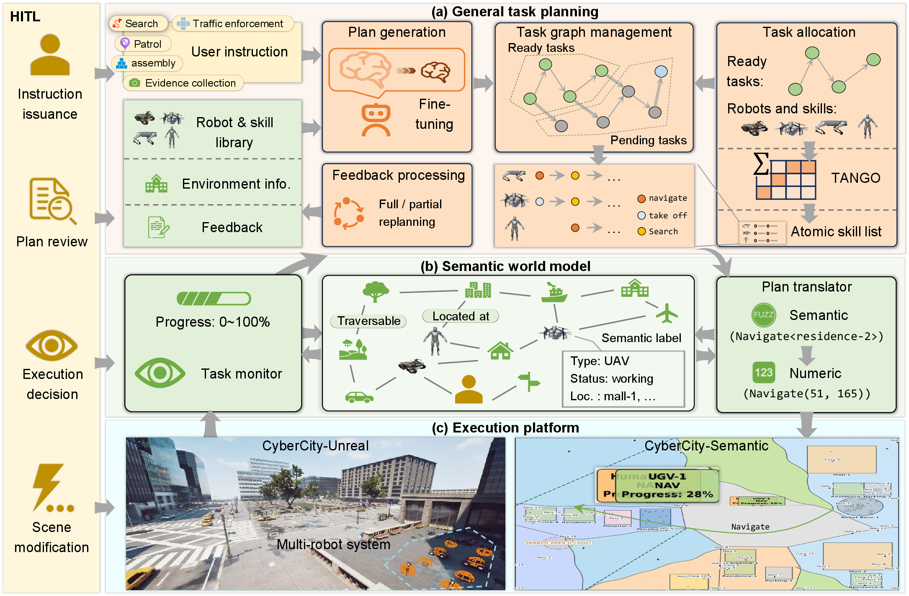
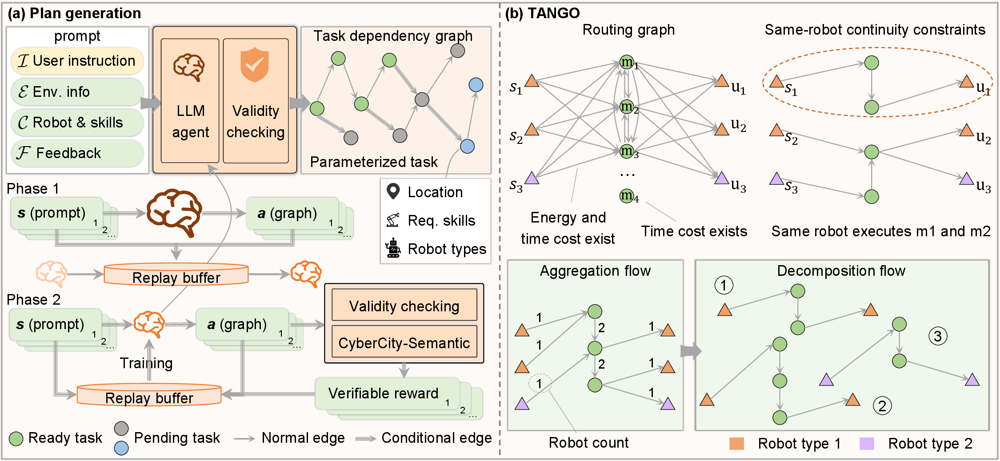
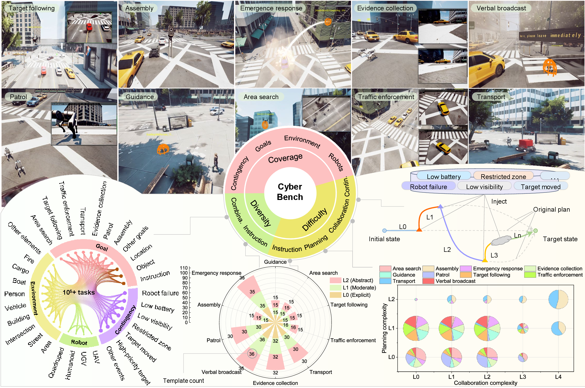
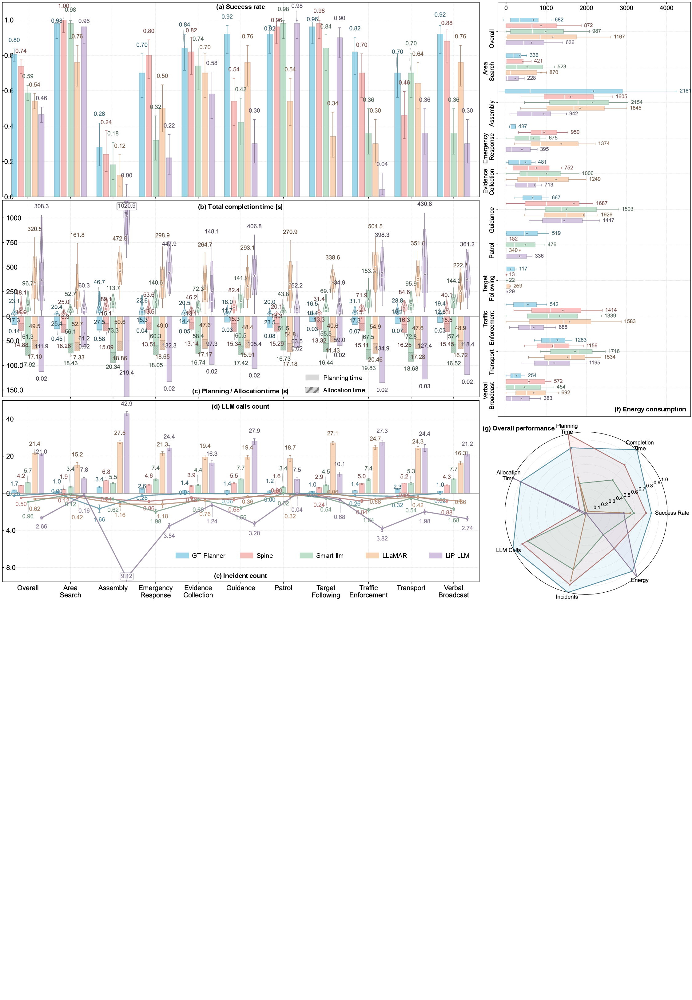
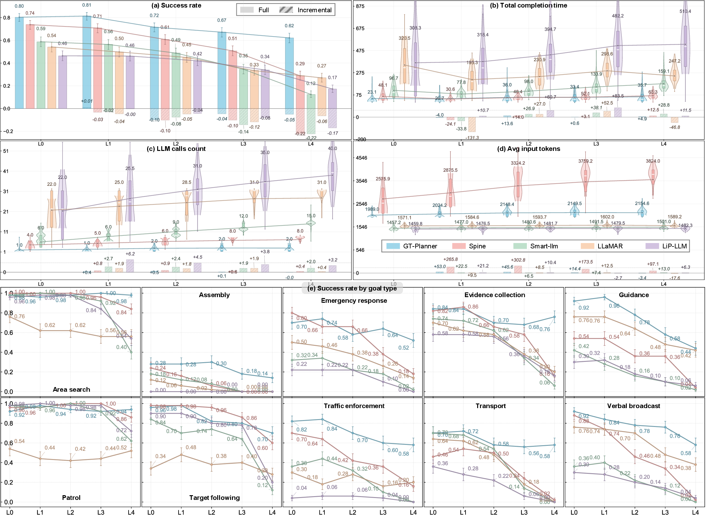

---
hide:
  - navigation
  - toc
---

  

    <section class="home-hero">
      

        

          <a class="home-brand" href=".">MultiAgent-Unreal</a>
          

            <a href="#overview">Overview</a>
            <a href="#framework">Framework</a>
            <a href="#results">Results</a>
            <a href="architecture/">Architecture</a>
            <a href="startup-and-examples/">Startup</a>
          

        

      

      

        

          UE5 Multi-Agent Simulation
          <h1 class="home-title">MultiAgent-Unreal</h1>
          

            A web-controlled multi-robot simulation platform for heterogeneous teams, task-graph review,
            skill allocation, and coordinated execution inside large Unreal Engine environments.
          

          

            Heterogeneous robots · Task graph review · Skill allocation · HITL execution · Scene-graph aware simulation
          

          

            <strong>Open-source simulation stack for:</strong> UAV, UGV, Quadruped, and Humanoid collaboration 
            <strong>Current focus:</strong> large-scale task execution, web-driven planning review, and multi-robot skill orchestration
          

          

            <a class="home-link-pill" href="https://github.com/MiangChen/MultiAgent-Unreal" target="_blank">Code</a>
            <a class="home-link-pill" href="startup-and-examples/">Run Example</a>
            <a class="home-link-pill home-link-pill-light" href="api-reference/">API</a>
            <a class="home-link-pill home-link-pill-light" href="architecture/">Architecture</a>
            <a class="home-link-pill home-link-pill-light" href="keybindings/">Keybindings</a>
          

        

        

          Live Workflow
          <h2>Plan, review, allocate, execute.</h2>
          

            The current stack already supports Web-side task submission, UE-side human-in-the-loop review,
            skill allocation visualization, and runtime execution for UAV, UGV, Quadruped, and Humanoid agents.
          

          

            UE5
            Web Console
            Task Graph
            Skill Allocation
          

          <figure class="home-figure">
            
          </figure>
        

      

    </section>

    <section class="home-section home-surface" id="overview">
      

        

          Abstract
          <h2>Multi-robot simulation as a controllable project page, not just a docs site.</h2>
          

            This site now serves two roles at once: a research-style homepage and an operational entry point.
            The platform connects external planning outputs, web-side review, and Unreal runtime execution.
          

        

        

          

            MultiAgent-Unreal is built around a practical loop: external planners emit task structures,
            the web console presents them for review, Unreal receives and visualizes the task graph and skill allocation,
            and heterogeneous robots execute the resulting skills in a shared 3D environment. The project is designed
            to support extendable robot types, object semantics, and task workflows while preserving a strong visual story
            for demos, papers, and external communication.
          

        

      

    </section>

    <section class="home-section" id="featured-media">
      

        

          Featured Media
          <h2>Main System Story</h2>
          

            The hero visual language should carry the same information as the paper figures: architecture, control loop,
            and runtime behavior.
          

        

        

          <video autoplay muted loop controls preload="auto" playsinline>
            <source src="assets/videos/home/human_robot_scheduling_demo.mp4" type="video/mp4">
          </video>
        

      

    </section>

    <section class="home-section home-surface" id="overview">
      

        

          Overview
          <h2>System Overview</h2>
          

            The platform centers on a UE runtime, a local web console, and a structured task pipeline:
            task graph review, skill allocation review, and final executable skill lists.
          

        

        

          <figure class="home-figure">
            
          </figure>
          

            <h3 class="home-card-title">From task intent to robot execution</h3>
            

              The external planner, task graph representation, web review flow, and UE execution runtime form a
              single closed loop. The project is designed to support multiple robot categories and extendable object semantics.
            

          

        

      

    </section>

    <section class="home-section" id="framework">
      

        

          Execution
          <h2>Execution Snapshots</h2>
          

            Current experiments already cover transport, collaborative task execution, and multi-task scheduling views.
          

        

        

          <article class="home-snapshot-stage">
            <figure class="home-snapshot-stage-media">
              
            </figure>
            

              <h3 data-snapshot-title>Transport Workflow</h3>
              

                Humanoid and UGV coordination for object movement and placement inside the simulated environment.
              

            

          </article>

          

            <button
              class="home-snapshot-item is-active"
              type="button"
              role="tab"
              aria-selected="true"
              data-snapshot-src="assets/images/home/fig6_transport_snapshots.png"
              data-snapshot-alt="Transport snapshots"
              data-snapshot-title="Transport Workflow"
              data-snapshot-description="Humanoid and UGV coordination for object movement and placement inside the simulated environment."
            >
              01
              
                <strong>Transport Workflow</strong>
                Humanoid and UGV coordination for object movement and placement.
              
            </button>

            <button
              class="home-snapshot-item"
              type="button"
              role="tab"
              aria-selected="false"
              data-snapshot-src="assets/images/home/fig7_multi_task_snapshots.png"
              data-snapshot-alt="Multi-task snapshots"
              data-snapshot-title="Multi-task Snapshots"
              data-snapshot-description="Concurrent tasks across heterogeneous robots, with role-specific skills and runtime execution views."
            >
              02
              
                <strong>Multi-task Snapshots</strong>
                Concurrent tasks across heterogeneous robots with role-specific skills.
              
            </button>

            <button
              class="home-snapshot-item"
              type="button"
              role="tab"
              aria-selected="false"
              data-snapshot-src="assets/images/home/fig7_multi_task_snapshots_xu.png"
              data-snapshot-alt="Additional multi-task snapshots"
              data-snapshot-title="Cross-scene Execution"
              data-snapshot-description="Different tasks and map layouts can be driven by the same control and skill-allocation pipeline."
            >
              03
              
                <strong>Cross-scene Execution</strong>
                Different tasks and map layouts driven by the same control pipeline.
              
            </button>
          

        

      

    </section>

    <section class="home-section home-surface" id="results">
      

        

          Results
          <h2>Planning and Evaluation</h2>
          

            The current figure set already supports a paper-style presentation: benchmark setup, general planning statistics,
            and dynamic replanning behavior.
          

        

        

          <article class="home-media-card">
            
            

              <h3>Benchmark Setting</h3>
              
Structured evaluation scenarios for multi-robot collaboration, web control, and simulation task flow.

            

          </article>
          <article class="home-media-card">
            
            

              <h3>General Task Planning</h3>
              
Aggregate planning outcomes can be presented directly on the site as paper-ready static figures.

            

          </article>
          <article class="home-media-card">
            
            

              <h3>Dynamic Replanning</h3>
              
Runtime replanning behavior and replanning statistics fit naturally into the same project-page layout.

            

          </article>
          <article class="home-media-card">
            
            

              <h3>Architecture as a First-Class Story</h3>
              
The site can present both research results and system architecture without switching visual language.

            

          </article>
        

      

    </section>

    <section class="home-section">
      

        

          

            <h2>Start from the docs, then move into live control.</h2>
            

              The project already includes architecture notes, startup instructions, API references, and a web-driven
              runtime workflow. This homepage is the landing layer; the deeper operational material stays in the docs.
            

            

              macOS / Linux
              UAV / UGV / Quadruped / Humanoid
              Task Graph + HITL
              Mock Backend + Web Demo
            

          

          

            <a class="home-button home-button-dark" href="startup-and-examples/">Startup Guide</a>
            <a class="home-button home-button-light" href="architecture/">See Architecture</a>
          

        

      

    </section>
  

